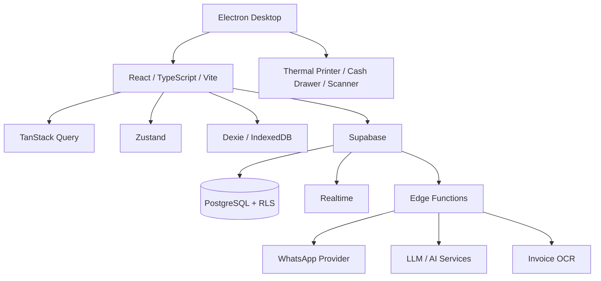

# ZAIPOS — Bahrain-Native, AI-Powered Point of Sale

ZAIPOS is an offline-first, multi-tenant point-of-sale and operations platform designed for businesses in the **Kingdom of Bahrain**. It supports retail stores, supermarkets, cafés, bakeries, restaurants, table service, in-house delivery, WhatsApp-assisted ordering, and Bahrain marketplace order tracking.

The application runs as a browser/PWA experience and as an Electron desktop application with hardware support.

## Bahrain Baseline

ZAIPOS is intentionally opinionated around Bahrain business operations:

- **Primary market:** Kingdom of Bahrain
- **Interface language:** English
- **Locale:** `en-BH`
- **Currency:** Bahraini dinar (`BHD`)
- **Money precision:** three decimal places
- **Standard VAT default:** 10%, with product-level zero-rated/exempt treatment supported
- **Telephone convention:** Bahrain `+973`
- **Payment terminology:** Cash, Card, BenefitPay, Bank Transfer
- **Sales channels:** Physical POS, Tables, Talabat, WhatsApp, In-house Delivery
- **Address examples and demo data:** Bahrain-based
- **Receipt terminology:** CR, Bahrain address/contact details, VAT details when applicable

The repository must not reintroduce legacy product identity, non-Bahrain defaults, foreign demo fixtures, or removed marketplace integrations.

## Core Capabilities

### Point of Sale

- Barcode/SKU/product search
- Branch-aware inventory and pricing
- Product modifiers, complements, coupons, and discounts
- Cash, card, BenefitPay, and bank-transfer checkout
- Cash drawer and thermal-printer integration in Electron
- Offline mutation queue and idempotent synchronization
- Customer selection and loyalty data

### Inventory and Purchasing

- Branch inventory and inventory centres
- Purchases, adjustments, transfers, waste, returns, and production consumption
- Product catalogue, categories, units, recipes, combos, and modifiers
- Supplier management
- Invoice OCR workflows
- Channel-specific pricing

### Restaurant and Service Operations

- Tables and waiter workflows
- Kitchen Display System (KDS)
- Item-level preparation state
- Table settlement through the cash register
- Production workflows for prepared products

### Bahrain Sales Channels

| Channel | Purpose |
|---|---|
| Physical POS | In-store checkout and cash-register operation |
| Tables | On-premise table service |
| Talabat | Bahrain marketplace order ledger and commission tracking |
| WhatsApp | Customer messaging and AI-assisted order workflows |
| In-house Delivery | Store-managed delivery and courier workflow |

Talabat is treated as a local marketplace channel without fabricating undocumented partner API behavior. External accept/reject/dispatch API calls are not implemented unless a documented and authorized partner contract exists.

### Payments

The user-facing payment model is:

- **Cash**
- **Card**
- **BenefitPay**
- **Bank Transfer**

For backward-compatible cash-session reconciliation, BenefitPay is mapped to the existing internal QR accounting bucket and Bank Transfer uses the existing transfer bucket. This preserves historical totals while presenting Bahrain-native terminology.

### Reports and Back Office

- Sales and payment reporting
- Inventory movement and margin reporting
- Expenses
- Customers
- Staff, shifts, and attendance
- Branch management
- Business settings
- Receipt configuration
- Data-management and maintenance tools

## Architecture



### Multi-Tenancy

Each business is a tenant. Business data is scoped by `tenant_id`; branch data is additionally scoped by `branch_id`. Row Level Security and role-aware helper functions protect tenant and branch boundaries.

### Offline-First Runtime

Critical mutations can be queued in IndexedDB when connectivity is unavailable. The sync engine retries queued operations when connectivity returns. Idempotency keys are used on sensitive flows to prevent duplicated transactions.

### Desktop Runtime

Electron provides desktop packaging, local settings, printer integration, cash-drawer support, barcode/serial access, and application-update plumbing.

## Technology Stack

| Area | Technology |
|---|---|
| Frontend | React 18, TypeScript, Vite |
| UI | Tailwind CSS, Radix UI, shadcn/ui patterns |
| State | Zustand, TanStack Query |
| Offline | Dexie / IndexedDB |
| Backend | Supabase PostgreSQL, Auth, Realtime, Edge Functions |
| Desktop | Electron, electron-builder |
| PWA | vite-plugin-pwa / Workbox |
| Testing | Vitest, React Testing Library |
| Validation | ESLint, TypeScript, migration validator |

## Project Structure

```text
src/
  components/              Shared and layout components
  hooks/                   Application hooks
  integrations/supabase/   Supabase client and generated types
  lib/                     Shared utilities and Bahrain defaults
  modules/                 POS, inventory, reports, settings, delivery, etc.
  pages/                   Route-level pages
  stores/                  Zustand stores

electron/                  Electron main process and hardware services
supabase/
  functions/               Edge Functions
  migrations/              PostgreSQL migrations
  seed.sql                 Bahrain-native local seed

deployments/               Deployment templates and example instances
docs/                      Extended technical documentation
public/                    PWA and desktop assets
```

## Bahrain Data Model Notes

### Currency

All new business defaults use `BHD`. Shared formatting uses `en-BH` and three fraction digits. Avoid hard-coded foreign currency symbols, non-Bahrain shortcuts, or zero-decimal currency assumptions.

### VAT

New tenants default to 10% standard VAT. Product tax rates remain configurable so valid zero-rated and exempt items can be represented. Tax configuration in ZAIPOS is operational software configuration and does not replace tax advice or official NBR guidance.

### Phone Numbers

The shared Bahrain helpers normalize local eight-digit Bahrain numbers to `+973` format for storage/display workflows where normalization is appropriate.

### Addresses

Demo and placeholder addresses use Bahrain areas such as Manama, Muharraq, Riffa, Isa Town, Hamad Town, Seef, Juffair, Amwaj Islands, and Saar rather than Bahraini street conventions.

## Database Migrations

The repository includes Bahrain cutover migrations that:

1. add the `talabat` sales-channel enum value;
2. apply BHD / 10% / Bahrain channel defaults;
3. convert the inherited country-specific demo tenant where safely identifiable;
4. prevent historical country-specific demo-user creation on fresh environments.

Existing historical enum values may remain in PostgreSQL where destructive enum removal would be unsafe. They are compatibility artifacts only and are not active ZAIPOS Bahrain channels.

## Local Development

### Requirements

- Node.js 20+
- npm
- Supabase CLI when running the local backend

### Install

```bash
git clone https://github.com/MuhamedZanabal/ZAIPOS.git
cd ZAIPOS
npm ci
```

Configure environment variables from `.env.example`, then run:

```bash
npm run dev
```

### Quality Gates

```bash
npm run validate:migrations
npm run lint
npm run test
npm run build
```

### Electron

```bash
npm run dev:electron
npm run build:electron
```

## Environment Variables

See `.env.example` for the supported variables. Do not commit production secrets. Supabase service-role keys and third-party API secrets belong in secure server-side configuration only.

## Deployment

ZAIPOS supports static/PWA hosting, Electron packaging, and Docker-based deployment. See `deployments/` and `docs/SETUP.md` for deployment details.

The example deployment is named `demo-zaipos`; legacy demo instance names are not part of the supported configuration.

## Security

- Row Level Security is used for tenant-scoped data.
- Branch permissions are role-aware.
- Sensitive server operations use controlled RPCs or Edge Functions.
- Do not place service-role credentials in browser code.
- Do not commit hard-coded passwords or production secrets.
- Preserve idempotency in checkout and synchronization flows.

## Compatibility Rules

Some internal identifiers are intentionally retained when renaming them would break existing installations or historical accounting. Examples include persisted local store names and existing payment-reconciliation columns. These compatibility identifiers must not surface as old product branding or non-Bahrain user-facing terminology.

## License

ZAIPOS is licensed under the MIT License. See [LICENSE](LICENSE).

## Contribution

See [CONTRIBUTING.md](CONTRIBUTING.md). All contributions should preserve the ZAIPOS name, English interface, and Bahrain-native defaults described above.
