# POS S360T — AI-Powered, Offline-First Point of Sale

[](https://opensource.org/licenses/Apache-2.0)
[](https://react.dev)
[](https://www.typescriptlang.org)
[](https://vitejs.dev)
[](https://supabase.com)
[](https://www.electronjs.org)
[](https://web.dev/progressive-web-apps/)

> An open-source, multi-tenant, multi-channel point-of-sale system for retail stores, restaurants, bakeries, and delivery businesses. Built with **React**, **Supabase**, and **AI agents**. Runs as a **PWA** in the browser, as a **desktop app** via Electron, and in **Docker** for self-hosting.

---

## Table of Contents

- [Why POS S360T?](#why-pos-s360t)
- [What You Get](#what-you-get)
- [Screenshots](#screenshots)
- [System Architecture](#system-architecture)
- [Technology Stack](#technology-stack)
- [Project Structure](#project-structure)
- [Core Concepts](#core-concepts)
  - [Multi-Tenancy](#multi-tenancy)
  - [Multi-Branch](#multi-branch)
  - [Offline-First](#offline-first)
  - [Row Level Security](#row-level-security)
- [Modules in Detail](#modules-in-detail)
- [Business Flows](#business-flows)
  - [POS Quick Sale](#pos-quick-sale)
  - [Table Service & KDS](#table-service--kds)
  - [Delivery Orders](#delivery-orders)
  - [Rappi / Digital Orders](#rappi--digital-orders)
  - [Inventory & Kardex](#inventory--kardex)
  - [Production / Kitchen](#production--kitchen)
  - [Cash Register](#cash-register)
  - [WhatsApp AI Agent](#whatsapp-ai-agent)
  - [QR Self-Ordering](#qr-self-ordering)
  - [Invoice OCR](#invoice-ocr)
- [AI Agent](#ai-agent)
- [Offline-First Sync Engine](#offline-first-sync-engine)
- [Database Overview](#database-overview)
- [Security Model](#security-model)
- [Hardware Integration](#hardware-integration)
- [Getting Started](#getting-started)
  - [Prerequisites](#prerequisites)
  - [Local Setup](#local-setup)
  - [Supabase Configuration](#supabase-configuration)
  - [Optional Integrations](#optional-integrations)
  - [Running Tests](#running-tests)
- [Environment Variables](#environment-variables)
- [Deployment](#deployment)
  - [Docker](#docker)
  - [Docker Compose per Tenant](#docker-compose-per-tenant)
  - [Electron Desktop](#electron-desktop)
  - [PWA / Static Hosting](#pwa--static-hosting)
- [Development Guide](#development-guide)
- [Troubleshooting](#troubleshooting)
- [Contributing](#contributing)
- [License](#license)
- [Acknowledgments](#acknowledgments)
- [Acknowledgments](#acknowledgments)

---

## Why POS S360T?

Small and medium businesses in Latin America and beyond often juggle multiple tools: a basic cash register, a spreadsheet for inventory, WhatsApp for orders, and third-party tablets for delivery apps. POS S360T unifies those workflows into one platform.

### Design Goals

1. **Offline-first** — Keep selling even when the internet fails. Sync automatically when it returns.
2. **Multi-channel** — In-store POS, table service, delivery, QR self-ordering, WhatsApp AI, and delivery platforms in one place.
3. **Multi-tenant & multi-branch** — Run one codebase for many businesses, each with their own branches, users, and data isolation.
4. **AI-ready** — Conversational ordering, invoice OCR, and knowledge-base answers out of the box.
5. **Hardware support** — Thermal printers, cash drawers, and barcode scanners through the Electron desktop app.
6. **Open source** — Apache 2.0 license. Self-host, customize, and contribute.

---

## What You Get

### Sales Channels

| Channel | How It Works |
|---------|--------------|
| **In-store POS** | Fast terminal with barcode scanning, mixed payments, and receipts. |
| **Table Service** | Waiters take orders by table; kitchen sees them on the KDS. |
| **Delivery** | Register phone/delivery orders with courier assignment and payment tracking. |
| **QR Self-Ordering** | Customers scan a QR code, browse the menu, and order without a waiter. |
| **WhatsApp AI Agent** | Customers chat with an AI that searches the catalog, quotes, and creates orders. |
| **Rappi / Didi / Uber** | Receive digital orders via webhooks, sync menu, and manage status. |

### Back-Office Modules

| Module | Purpose |
|--------|---------|
| **Inventory** | Real-time stock, kardex, transfers, waste tracking, low-stock alerts. |
| **Products** | Catalog with categories, recipes, combos, modifiers, and channel prices. |
| **Production** | Convert raw materials into finished products with automatic consumption. |
| **Purchases** | Purchase orders to suppliers, returns, and invoice OCR. |
| **Cash Register** | Open/close sessions, cash in/out movements, and reconciliation. |
| **Expenses** | Track operational expenses by category. |
| **Customers** | Basic CRM with purchase history. |
| **Staff** | Employees, shifts, and attendance. |
| **Reports** | Sales, inventory, expenses, margins, and exports. |
| **Settings** | Business config, hardware, integrations, users, and AI agent. |

---

## Screenshots

### Dashboard & POS

| Dashboard (Desktop) | POS Terminal | Inventory |
|---------------------|--------------|-----------|
| 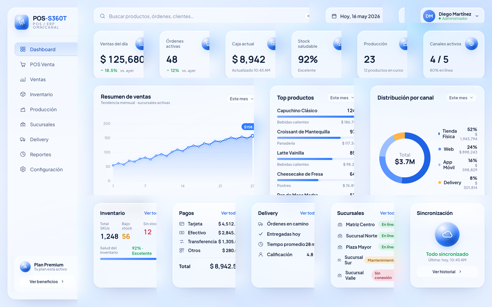 | 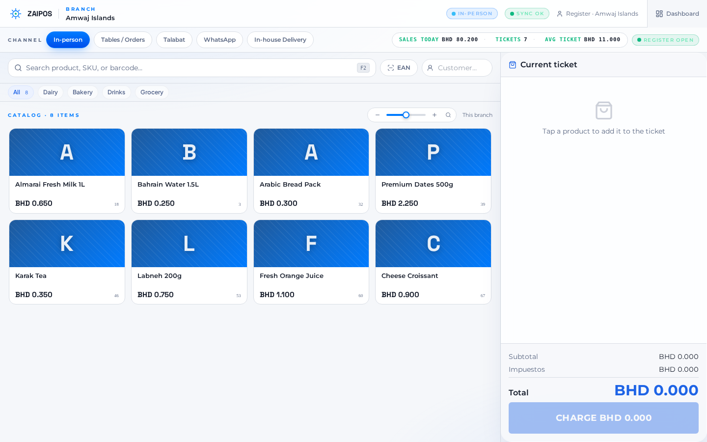 | 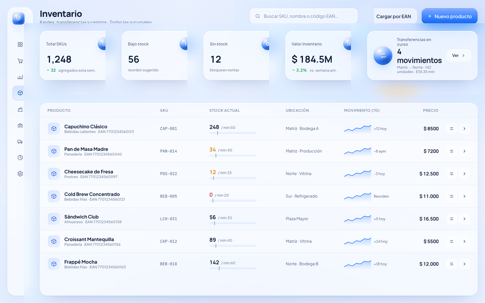 |

### Service & Kitchen

| Tables / Salon Plan | KDS / Kitchen | Production |
|---------------------|---------------|------------|
| 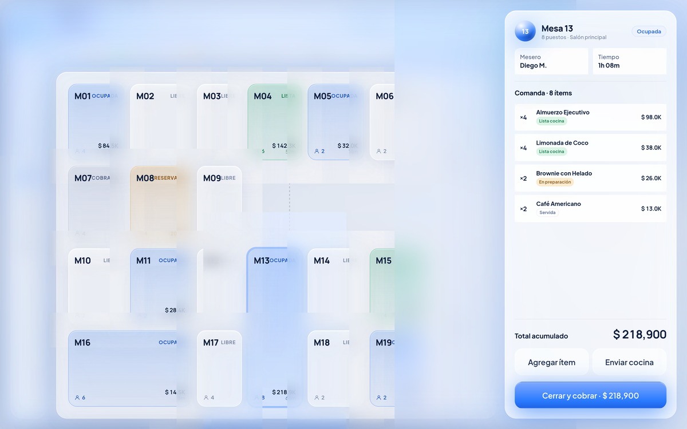 | 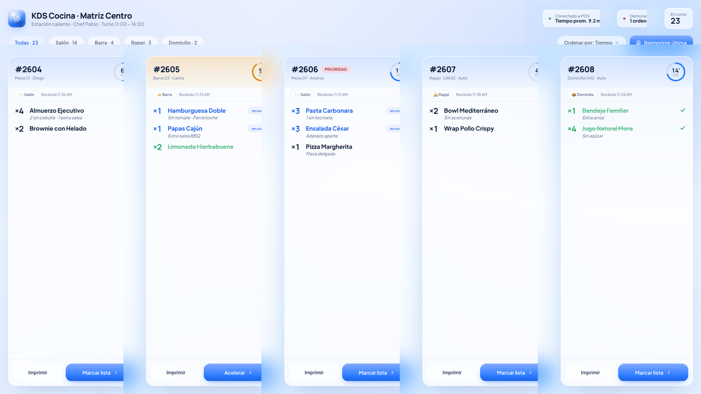 | 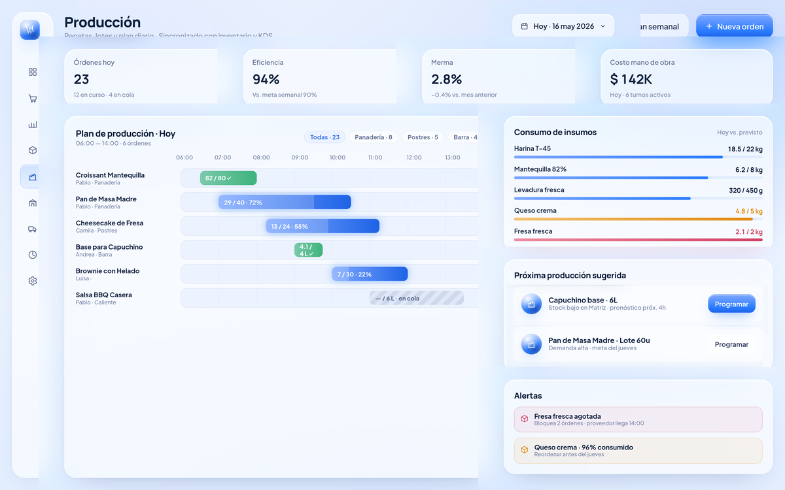 |

### AI Agent

| AI Agent (Desktop) | AI Agent (Mobile) |
|--------------------|-------------------|
| 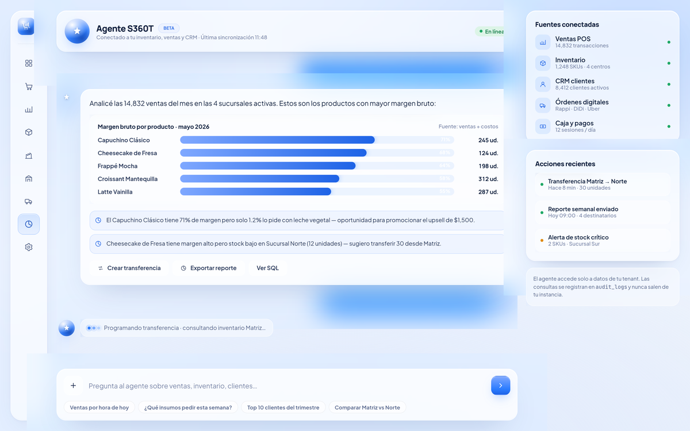 | 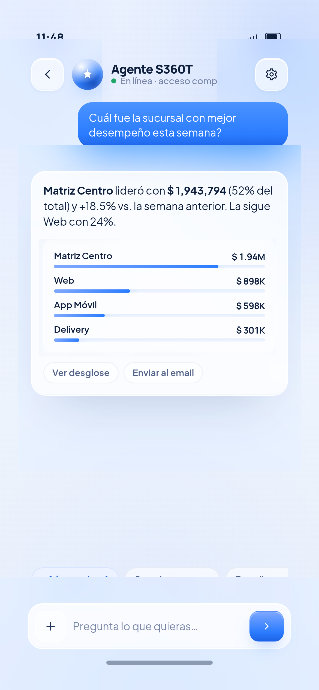 |

### Responsive Views

| Dashboard (Tablet) | Dashboard (Mobile) | POS (Mobile) |
|--------------------|--------------------|--------------|
| 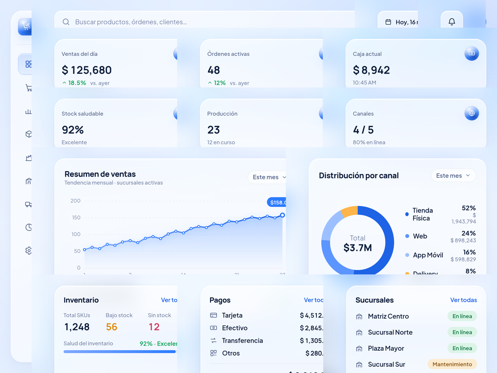 | 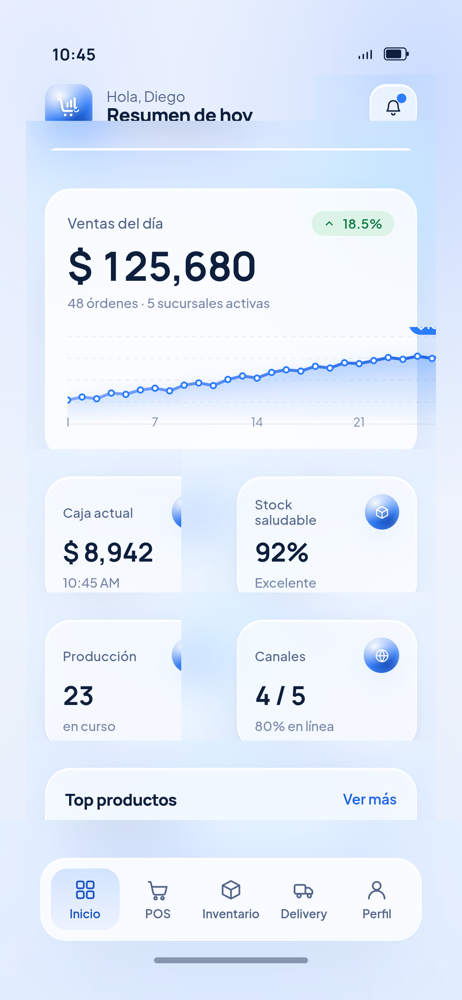 | 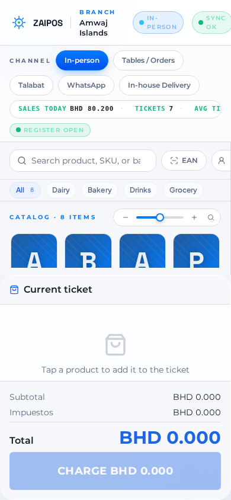 |

### Settings & Landing

| Settings | Landing |
|----------|---------|
| 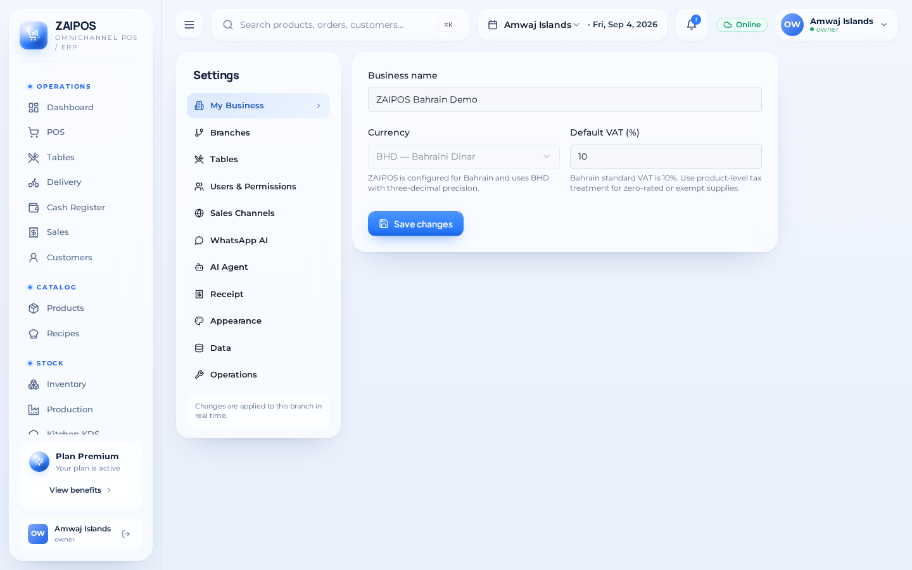 |  |

All screenshots are stored in [`docs/screenshots/`](docs/screenshots/).

---

## System Architecture

### High-Level Overview

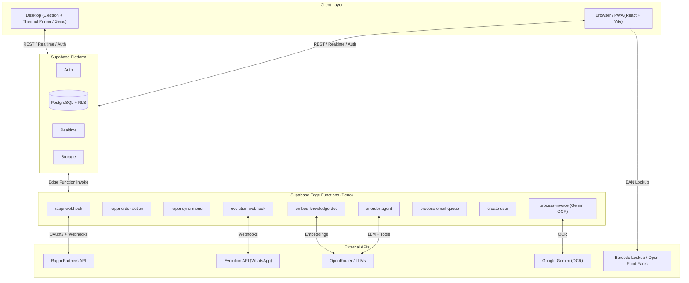
```mermaid
flowchart TB
    subgraph Client["Client Layer"]
        Browser["Browser / PWA (React + Vite)"]
        ElectronApp["Desktop (Electron + Thermal Printer / Serial)"]
    end

    subgraph Edge["Supabase Edge Functions (Deno)"]
        EF_Rappi["rappi-webhook"]
        EF_RappiAction["rappi-order-action"]
        EF_RappiSync["rappi-sync-menu"]
        EF_Evolution["evolution-webhook"]
        EF_AI["ai-order-agent"]
        EF_Invoice["process-invoice (Gemini OCR)"]
        EF_Email["process-email-queue"]
        EF_CreateUser["create-user"]
        EF_Embed["embed-knowledge-doc"]
    end

    subgraph Supabase["Supabase Platform"]
        Auth["Auth"]
        DB[(PostgreSQL + RLS)]
        Realtime["Realtime"]
        Storage["Storage"]
    end

    subgraph External["External APIs"]
        Rappi["Rappi Partners API"]
        Evolution["Evolution API (WhatsApp)"]
        OpenRouter["OpenRouter / LLMs"]
        Gemini["Google Gemini (OCR)"]
        Barcode["Barcode Lookup / Open Food Facts"]
    end

    Browser <-->|"REST / Realtime / Auth"| Supabase
    ElectronApp <-->|"REST / Realtime / Auth"| Supabase
    EF_Rappi <-->|"OAuth2 + Webhooks"| Rappi
    EF_Evolution <-->|"Webhooks"| Evolution
    EF_AI <-->|"LLM + Tools"| OpenRouter
    EF_Embed <-->|"Embeddings"| OpenRouter
    EF_Invoice <-->|"OCR"| Gemini
    Browser -->|"EAN Lookup"| Barcode
    Supabase <-->|"Edge Function invoke"| Edge
```

### Frontend State Architecture

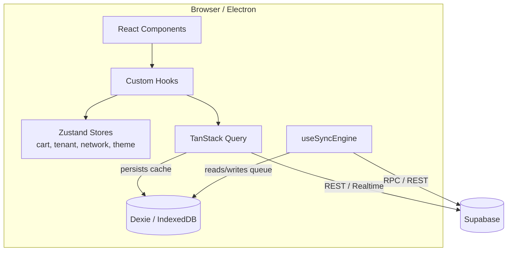
```mermaid
flowchart TB
    subgraph Browser["Browser / Electron"]
        UI["React Components"]
        Hooks["Custom Hooks"]
        Zustand["Zustand Stores\ncart, tenant, network, theme"]
        TQuery["TanStack Query"]
        Sync["useSyncEngine"]
        Dexie[(Dexie / IndexedDB)]
    end

    UI --> Hooks
    Hooks --> Zustand
    Hooks --> TQuery
    TQuery -->|"persists cache"| Dexie
    Sync -->|"reads/writes queue"| Dexie
    TQuery -->|"REST / Realtime"| Supabase[(Supabase)]
    Sync -->|"RPC / REST"| Supabase
```

### Backend Data Flow

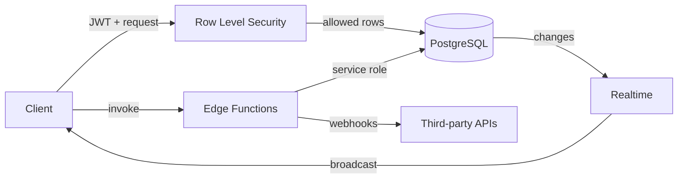
```mermaid
flowchart LR
    Client["Client"] -->|"JWT + request"| RLS["Row Level Security"]
    RLS -->|"allowed rows"| DB[(PostgreSQL)]
    Client -->|"invoke"| Edge["Edge Functions"]
    Edge -->|"service role"| DB
    Edge -->|"webhooks"| External["Third-party APIs"]
    DB -->|"changes"| Realtime["Realtime"]
    Realtime -->|"broadcast"| Client
```

---

## Technology Stack

| Layer | Technology |
|-------|------------|
| **Frontend Framework** | React 18 + TypeScript |
| **Build Tool** | Vite 5 |
| **UI Library** | Tailwind CSS + Radix UI + shadcn/ui |
| **Client State** | Zustand |
| **Server State** | TanStack Query v5 with IndexedDB persistence |
| **Offline Queue** | Dexie (IndexedDB) |
| **Backend** | Supabase (PostgreSQL, Auth, Realtime, Edge Functions) |
| **Desktop** | Electron 42 + vite-plugin-electron |
| **PWA** | Vite PWA plugin + Workbox |
| **AI / LLM** | OpenRouter (Claude, GPT-4o, Gemini) |
| **OCR** | Google Gemini |
| **Barcode** | Barcode Lookup API + Open Food Facts |
| **Container** | Docker + nginx |
| **Testing** | Vitest + React Testing Library + jsdom |
| **Linting** | ESLint 9 + TypeScript ESLint |

---

## Project Structure

```text
src/
├── components/
│   ├── layout/          # AppShell, ProtectedRoute, TenantProvider, Sidebar
│   ├── shared/          # Reusable business widgets
│   ├── ui/              # shadcn/ui primitives
│   └── pwa/             # PWA install prompt
├── hooks/               # Custom React hooks
├── lib/                 # Business utilities and core helpers
├── modules/             # Feature modules (pos, inventory, tables, etc.)
├── pages/               # Top-level route pages
├── stores/              # Zustand stores
├── types/               # Shared TypeScript types
├── integrations/supabase/
│   ├── client.ts        # Browser Supabase client
│   └── types.ts         # Generated database types
└── main.tsx             # Application entry point

electron/                # Desktop main process, preload, and services
supabase/
├── functions/           # Edge Functions (Deno)
├── migrations/          # PostgreSQL schema migrations
└── config.toml          # Local Supabase CLI config (no secrets)

deployments/             # Per-customer Docker Compose templates
docs/                    # Extended documentation
public/                  # Static assets and PWA icons
```

---

## Core Concepts

### Multi-Tenancy

Each business is a **tenant**. Tenants are resolved by the incoming domain name (`tenant.domain`). The `TenantProvider` reads the hostname, looks up the tenant, and exposes `tenantId`, `branchId`, and user roles to the rest of the app.

```text
customer-domain.com
    └── tenant_id (UUID)
            ├── branches[]
            ├── user_roles[]
            ├── products[]
            ├── product_channel_prices[]
            └── inventory_stocks[]
```

### Multi-Branch

A tenant can have multiple branches (sucursales). Each branch has its own:

- Inventory centers and stock
- Cash registers and sessions
- Tables and table orders
- Users and roles
- Channel prices

### Offline-First

The app stores pending mutations in IndexedDB. When connectivity returns, a sync engine flushes the queue to Supabase. All critical operations use idempotency keys to prevent duplicates on retry.

### Row Level Security

Every tenant-scoped table has RLS policies. A user can only read or write rows where `tenant_id` and `branch_id` match their assigned roles. The `super_admin` role can access all tenants.

---

## Modules in Detail

### POS Terminal (`/pos`)

The main sales screen. Cashiers can:

- Search products by name, SKU, or barcode.
- Apply modifiers and complements.
- Choose payment methods (cash, card, transfer, mixed).
- Print receipts (Electron) or show digital tickets.
- Apply discounts and coupons.

### Inventory (`/inventory`)

- View stock by branch and inventory center.
- Record purchases, adjustments, transfers, and waste.
- See full kardex history.
- Bulk import products via CSV.
- Upload supplier invoices for OCR processing.

### Products (`/products`)

- Manage simple, composite, and combo products.
- Assign categories, barcodes, SKUs, and units.
- Configure recipes for prepared items.
- Set channel-specific prices (POS, delivery, Rappi, Didi, Uber).
- Define modifier groups (e.g., "Add bacon", "No onion").

### Tables & KDS (`/tables`, `/kds`)

- Visual table plan with status colors.
- Waiter order entry per table.
- Kitchen Display System with item-level status tracking.
- Dispatch workflow: pending → preparing → ready → dispatched.

### Delivery (`/delivery`)

- Kanban board of delivery orders.
- Courier assignment and status tracking.
- Delivery payments independent from table/pos sales.

### Digital Orders (`/digital-orders`)

- Receive orders from Rappi, Didi, and Uber Eats.
- Real-time webhook processing.
- Accept, reject, ready, and dispatch actions for Rappi.

### Cash (`/cash`)

- Open and close cash sessions.
- Record cash in/out movements.
- Reconciliation report.

### Reports (`/reports`)

- Sales by period, product, and payment method.
- Inventory movements and margins.
- Expenses summary.
- Export to CSV.

### WhatsApp Inbox (`/whatsapp`)

- Human agent view of AI conversations.
- Handoff from AI to human.
- Quick replies and product search.

### Settings (`/settings`)

- Business information and branding.
- Users and roles.
- Hardware configuration.
- Rappi, WhatsApp, and AI agent configuration.
- Channel prices and tax settings.

---

## Business Flows

### POS Quick Sale

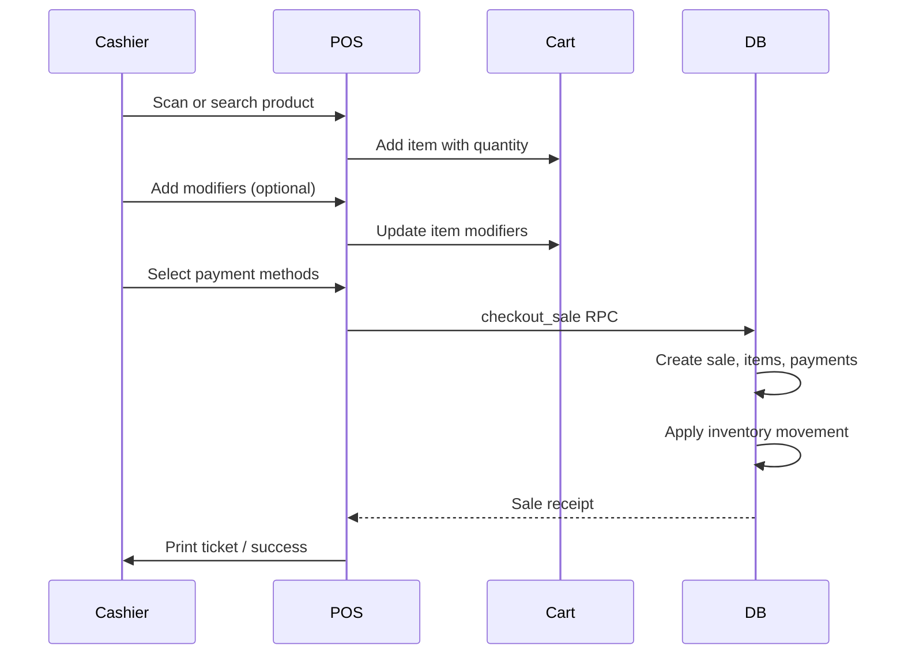
```mermaid
sequenceDiagram
    participant Cashier
    participant POS
    participant Cart
    participant DB

    Cashier->>POS: Scan or search product
    POS->>Cart: Add item with quantity
    Cashier->>POS: Add modifiers (optional)
    POS->>Cart: Update item modifiers
    Cashier->>POS: Select payment methods
    POS->>DB: checkout_sale RPC
    DB->>DB: Create sale, items, payments
    DB->>DB: Apply inventory movement
    DB-->>POS: Sale receipt
    POS->>Cashier: Print ticket / success
```

### Table Service & KDS

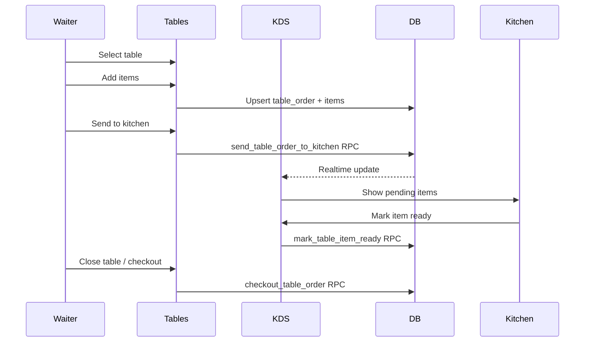
```mermaid
sequenceDiagram
    participant Waiter
    participant Tables
    participant KDS
    participant DB

    Waiter->>Tables: Select table
    Waiter->>Tables: Add items
    Tables->>DB: Upsert table_order + items
    Waiter->>Tables: Send to kitchen
    Tables->>DB: send_table_order_to_kitchen RPC
    DB-->>KDS: Realtime update
    KDS->>Kitchen: Show pending items
    Kitchen->>KDS: Mark item ready
    KDS->>DB: mark_table_item_ready RPC
    Waiter->>Tables: Close table / checkout
    Tables->>DB: checkout_table_order RPC
```

### Delivery Orders

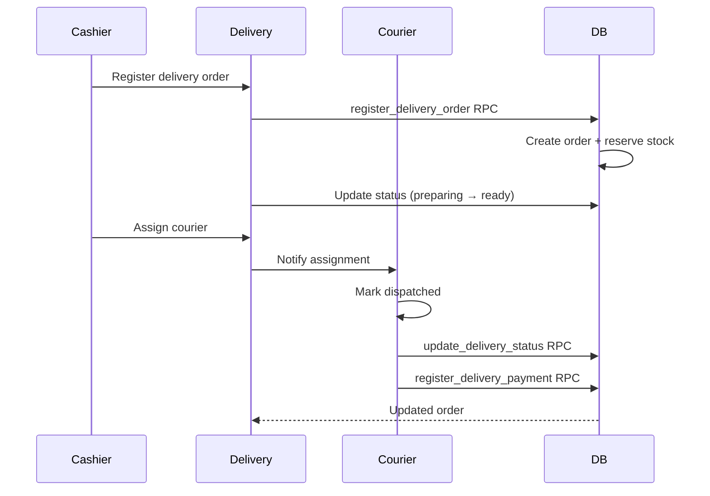
```mermaid
sequenceDiagram
    participant Cashier
    participant Delivery
    participant Courier
    participant DB

    Cashier->>Delivery: Register delivery order
    Delivery->>DB: register_delivery_order RPC
    DB->>DB: Create order + reserve stock
    Delivery->>DB: Update status (preparing → ready)
    Cashier->>Delivery: Assign courier
    Delivery->>Courier: Notify assignment
    Courier->>Courier: Mark dispatched
    Courier->>DB: update_delivery_status RPC
    Courier->>DB: register_delivery_payment RPC
    DB-->>Delivery: Updated order
```

### Rappi / Digital Orders

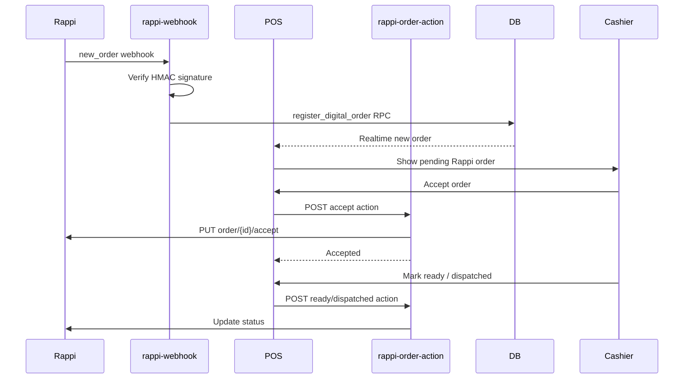
```mermaid
sequenceDiagram
    participant Rappi
    participant Webhook as rappi-webhook
    participant POS
    participant Action as rappi-order-action
    participant DB

    Rappi->>Webhook: new_order webhook
    Webhook->>Webhook: Verify HMAC signature
    Webhook->>DB: register_digital_order RPC
    DB-->>POS: Realtime new order
    POS->>Cashier: Show pending Rappi order
    Cashier->>POS: Accept order
    POS->>Action: POST accept action
    Action->>Rappi: PUT order/{id}/accept
    Action-->>POS: Accepted
    Cashier->>POS: Mark ready / dispatched
    POS->>Action: POST ready/dispatched action
    Action->>Rappi: Update status
```

### Inventory & Kardex

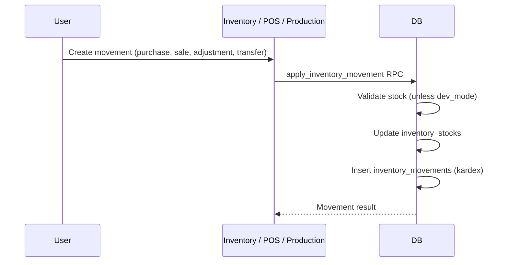
```mermaid
sequenceDiagram
    participant User
    participant Module as Inventory / POS / Production
    participant DB

    User->>Module: Create movement (purchase, sale, adjustment, transfer)
    Module->>DB: apply_inventory_movement RPC
    DB->>DB: Validate stock (unless dev_mode)
    DB->>DB: Update inventory_stocks
    DB->>DB: Insert inventory_movements (kardex)
    DB-->>Module: Movement result
```

### Production / Kitchen

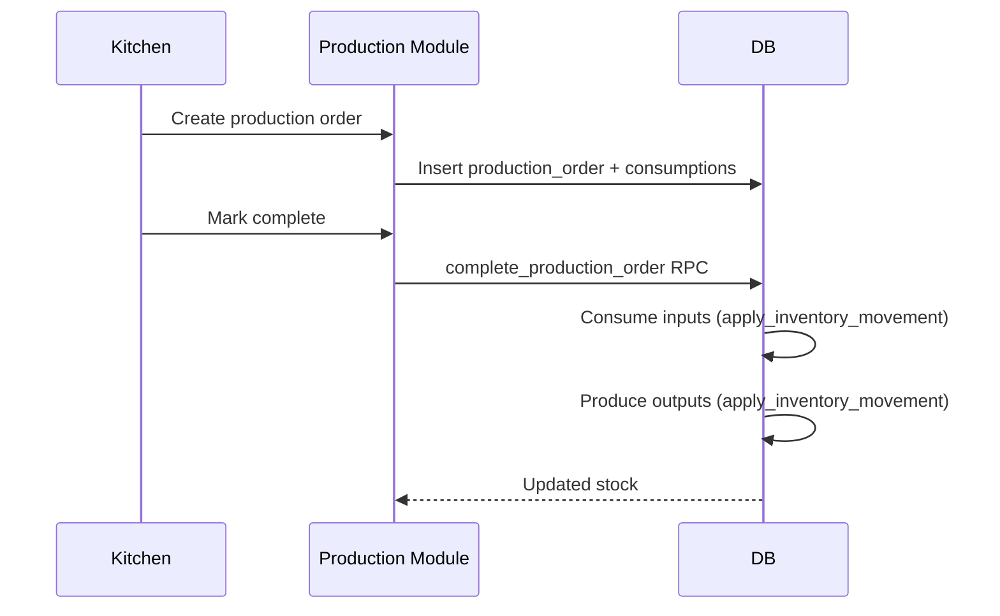
```mermaid
sequenceDiagram
    participant Kitchen
    participant Prod as Production Module
    participant DB

    Kitchen->>Prod: Create production order
    Prod->>DB: Insert production_order + consumptions
    Kitchen->>Prod: Mark complete
    Prod->>DB: complete_production_order RPC
    DB->>DB: Consume inputs (apply_inventory_movement)
    DB->>DB: Produce outputs (apply_inventory_movement)
    DB-->>Prod: Updated stock
```

### Cash Register

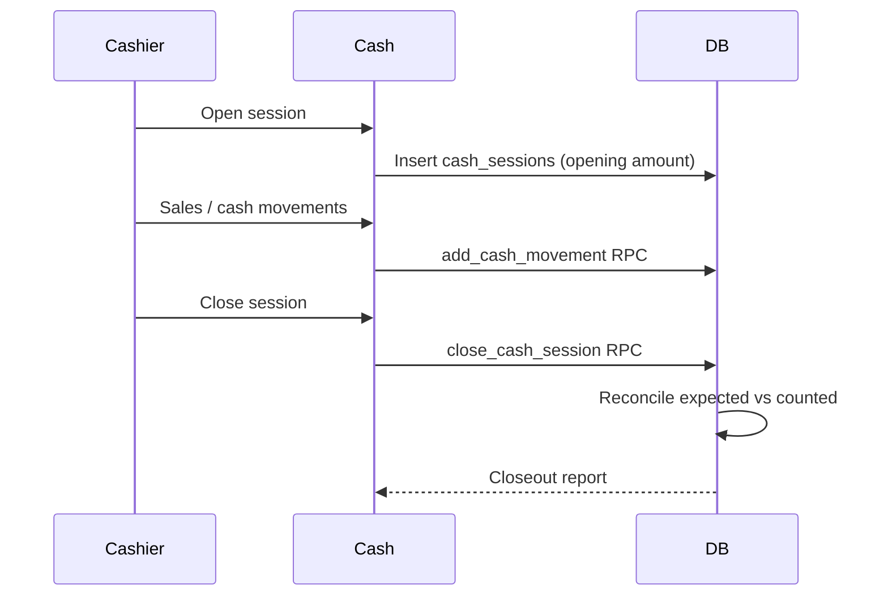
```mermaid
sequenceDiagram
    participant Cashier
    participant Cash
    participant DB

    Cashier->>Cash: Open session
    Cash->>DB: Insert cash_sessions (opening amount)
    Cashier->>Cash: Sales / cash movements
    Cash->>DB: add_cash_movement RPC
    Cashier->>Cash: Close session
    Cash->>DB: close_cash_session RPC
    DB->>DB: Reconcile expected vs counted
    DB-->>Cash: Closeout report
```

### WhatsApp AI Agent

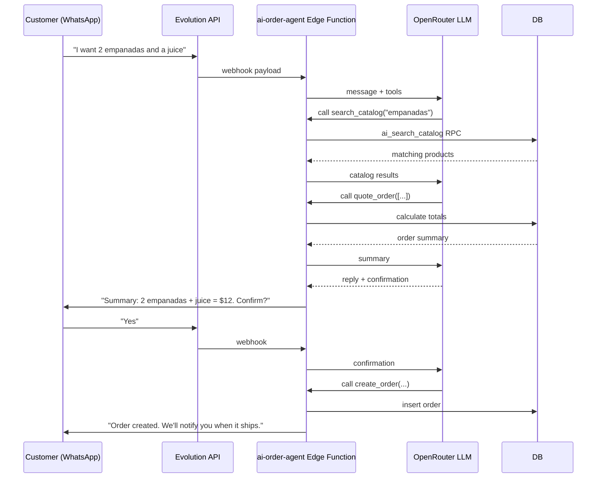
```mermaid
sequenceDiagram
    participant Customer as Customer (WhatsApp)
    participant Evo as Evolution API
    participant EF as ai-order-agent Edge Function
    participant LLM as OpenRouter LLM
    participant DB

    Customer->>Evo: "I want 2 empanadas and a juice"
    Evo->>EF: webhook payload
    EF->>LLM: message + tools
    LLM->>EF: call search_catalog("empanadas")
    EF->>DB: ai_search_catalog RPC
    DB-->>EF: matching products
    EF->>LLM: catalog results
    LLM->>EF: call quote_order([...])
    EF->>DB: calculate totals
    DB-->>EF: order summary
    EF->>LLM: summary
    LLM-->>EF: reply + confirmation
    EF->>Customer: "Summary: 2 empanadas + juice = $12. Confirm?"
    Customer->>Evo: "Yes"
    Evo->>EF: webhook
    EF->>LLM: confirmation
    LLM->>EF: call create_order(...)
    EF->>DB: insert order
    EF->>Customer: "Order created. We'll notify you when it ships."
```

### QR Self-Ordering

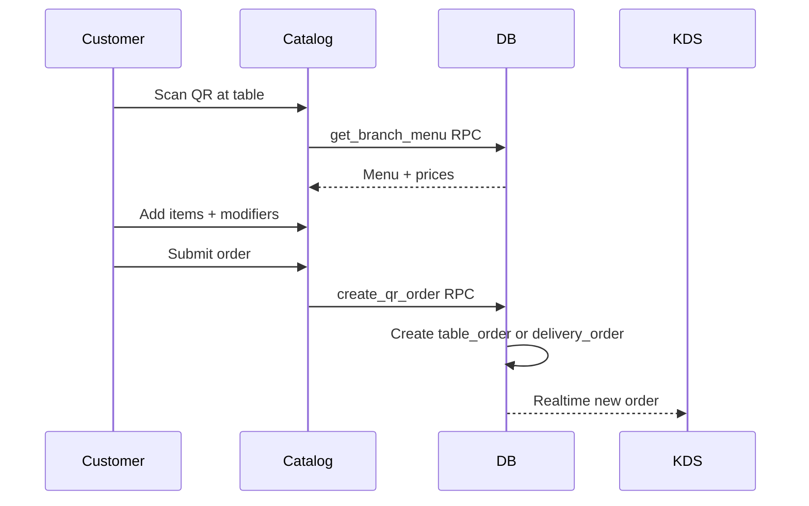
```mermaid
sequenceDiagram
    participant Customer
    participant Catalog
    participant DB
    participant KDS

    Customer->>Catalog: Scan QR at table
    Catalog->>DB: get_branch_menu RPC
    DB-->>Catalog: Menu + prices
    Customer->>Catalog: Add items + modifiers
    Customer->>Catalog: Submit order
    Catalog->>DB: create_qr_order RPC
    DB->>DB: Create table_order or delivery_order
    DB-->>KDS: Realtime new order
```

### Invoice OCR

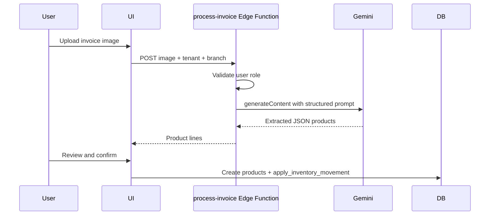
```mermaid
sequenceDiagram
    participant User
    participant UI
    participant EF as process-invoice Edge Function
    participant Gemini
    participant DB

    User->>UI: Upload invoice image
    UI->>EF: POST image + tenant + branch
    EF->>EF: Validate user role
    EF->>Gemini: generateContent with structured prompt
    Gemini-->>EF: Extracted JSON products
    EF-->>UI: Product lines
    User->>UI: Review and confirm
    UI->>DB: Create products + apply_inventory_movement
```

---

## AI Agent

The WhatsApp AI Agent handles end-to-end conversational orders. It exposes a set of tools to the LLM:

| Tool | Description |
|------|-------------|
| `search_catalog` | Search products by name, SKU, or barcode. |
| `quote_order` | Calculate the total for a list of items. |
| `create_order` | Create the final order after customer confirmation. |
| `handoff_to_human` | Escalate to a human operator. |

### Configuration

Each branch configures the agent in **Settings > AI Agent**:

- `system_prompt`: custom behavior instructions
- `ai_model`: OpenRouter model (Claude, GPT-4o, Gemini)
- `temperature`: creativity vs determinism
- `daily_recommendation`: product to suggest proactively
- `delivery_delay_minutes`: estimated delivery time

### Knowledge Base (RAG)

Branches can upload knowledge documents (opening hours, policies, specials). The system generates embeddings via OpenRouter and retrieves relevant documents during conversations.

### Supported Models

- `anthropic/claude-3.5-haiku`
- `anthropic/claude-3.5-sonnet`
- `openai/gpt-4o-mini`
- `openai/gpt-4o`
- `google/gemini-flash-1.5`

---

## Offline-First Sync Engine

### How It Works

1. User performs an action (sale, inventory movement, etc.).
2. If online, the mutation is sent immediately.
3. If offline, the mutation is stored in IndexedDB via Dexie.
4. `useSyncEngine` listens for connectivity and flushes the queue.
5. Each operation uses an idempotency key to prevent duplicates on retry.

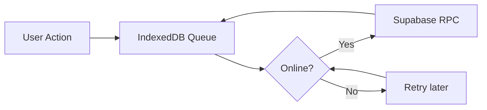
```mermaid
flowchart LR
    UI[User Action] --> Queue[IndexedDB Queue]
    Queue --> Network{Online?}
    Network -->|Yes| Server[Supabase RPC]
    Network -->|No| Retry[Retry later]
    Server --> Queue
    Retry --> Network
```

### Idempotency

The `operation_log` table stores idempotency keys. When a request is retried, the server returns the previously stored result instead of re-executing.

```sql
INSERT INTO operation_log (idempotency_key, operation, payload)
VALUES (..., ..., ...)
ON CONFLICT (idempotency_key) DO NOTHING
RETURNING *;
```

---

## Database Overview

### Core Entities

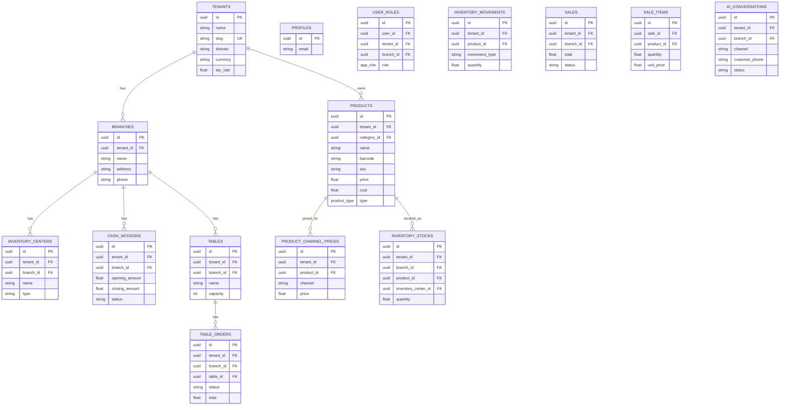
```mermaid
erDiagram
    TENANTS {
        uuid id PK
        string name
        string slug UK
        string domain
        string currency
        float tax_rate
    }

    BRANCHES {
        uuid id PK
        uuid tenant_id FK
        string name
        string address
        string phone
    }

    PROFILES {
        uuid id PK
        string email
    }

    USER_ROLES {
        uuid id PK
        uuid user_id FK
        uuid tenant_id FK
        uuid branch_id FK
        app_role role
    }

    PRODUCTS {
        uuid id PK
        uuid tenant_id FK
        uuid category_id FK
        string name
        string barcode
        string sku
        float price
        float cost
        product_type type
    }

    PRODUCT_CHANNEL_PRICES {
        uuid id PK
        uuid tenant_id FK
        uuid product_id FK
        string channel
        float price
    }

    INVENTORY_CENTERS {
        uuid id PK
        uuid tenant_id FK
        uuid branch_id FK
        string name
        string type
    }

    INVENTORY_STOCKS {
        uuid id PK
        uuid tenant_id FK
        uuid branch_id FK
        uuid product_id FK
        uuid inventory_center_id FK
        float quantity
    }

    INVENTORY_MOVEMENTS {
        uuid id PK
        uuid tenant_id FK
        uuid product_id FK
        string movement_type
        float quantity
    }

    SALES {
        uuid id PK
        uuid tenant_id FK
        uuid branch_id FK
        float total
        string status
    }

    SALE_ITEMS {
        uuid id PK
        uuid sale_id FK
        uuid product_id FK
        float quantity
        float unit_price
    }

    TABLES {
        uuid id PK
        uuid tenant_id FK
        uuid branch_id FK
        string name
        int capacity
    }

    TABLE_ORDERS {
        uuid id PK
        uuid tenant_id FK
        uuid branch_id FK
        uuid table_id FK
        string status
        float total
    }

    CASH_SESSIONS {
        uuid id PK
        uuid tenant_id FK
        uuid branch_id FK
        float opening_amount
        float closing_amount
        string status
    }

    AI_CONVERSATIONS {
        uuid id PK
        uuid tenant_id FK
        uuid branch_id FK
        string channel
        string customer_phone
        string status
    }

    TENANTS ||--o{ BRANCHES : has
    TENANTS ||--o{ PRODUCTS : owns
    PRODUCTS ||--o{ PRODUCT_CHANNEL_PRICES : priced_for
    PRODUCTS ||--o{ INVENTORY_STOCKS : stocked_as
    BRANCHES ||--o{ INVENTORY_CENTERS : has
    BRANCHES ||--o{ CASH_SESSIONS : has
    BRANCHES ||--o{ TABLES : has
    TABLES ||--o{ TABLE_ORDERS : has
```

### Key RPC Functions

| Area | Function | Purpose |
|------|----------|---------|
| Inventory | `apply_inventory_movement` | Atomic stock movement and kardex record. |
| Inventory | `transfer_inventory` | Transfer stock between centers. |
| Sales | `checkout_sale` | Close a POS sale. |
| Sales | `checkout_table_order` | Close a table order. |
| Sales | `register_delivery_order` | Create a delivery order. |
| Sales | `register_digital_order` | Insert a digital-platform order. |
| Tables | `send_table_order_to_kitchen` | Send a table order to KDS. |
| Tables | `mark_table_item_ready` | Mark a table item as ready. |
| Cash | `close_cash_session` | Close and reconcile a cash session. |
| Production | `complete_production_order` | Complete production and apply consumptions. |
| AI | `ai_search_catalog` | Search products for the AI agent. |
| AI | `create_qr_order` | Create an order from QR self-ordering. |

For the full schema, see [docs/DATABASE.md](docs/DATABASE.md).

---

## Security Model

### Secrets

- **No API keys, passwords, or tokens are hard-coded.** All secrets are environment variables.
- `VITE_*` variables are baked into the bundle. Never put service-role keys there.
- `.env` is ignored by Git.

### RLS

- Every tenant-scoped table has Row Level Security.
- Policies check `tenant_id` and `branch_id` against `user_roles`.
- `super_admin` can access all tenants.

### Webhooks

- Rappi and Evolution webhooks verify HMAC-SHA256 signatures.
- Timestamp freshness checks prevent replay attacks.
- Optional IP allowlists add another layer.

### Production Checklist

- [ ] Rotate all demo seed passwords.
- [ ] Use strong Supabase database password.
- [ ] Enable RLS on all tenant tables.
- [ ] Disable `ALLOW_UNSIGNED_RAPPI_WEBHOOKS`.
- [ ] Configure webhook IP allowlists.
- [ ] Use HTTPS everywhere.
- [ ] Keep dependencies updated.
- [ ] Enable Supabase MFA for project members.

For more details, see [docs/SECURITY.md](docs/SECURITY.md).

---

## Hardware Integration

The Electron desktop build supports:

| Device | Interface | Use Case |
|--------|-----------|----------|
| Thermal printer | USB (ESC/POS) | Print receipts and kitchen tickets. |
| Cash drawer | Printer pulse | Open drawer after cash sale. |
| Barcode scanner | HID keyboard or Serial | Scan product barcodes. |

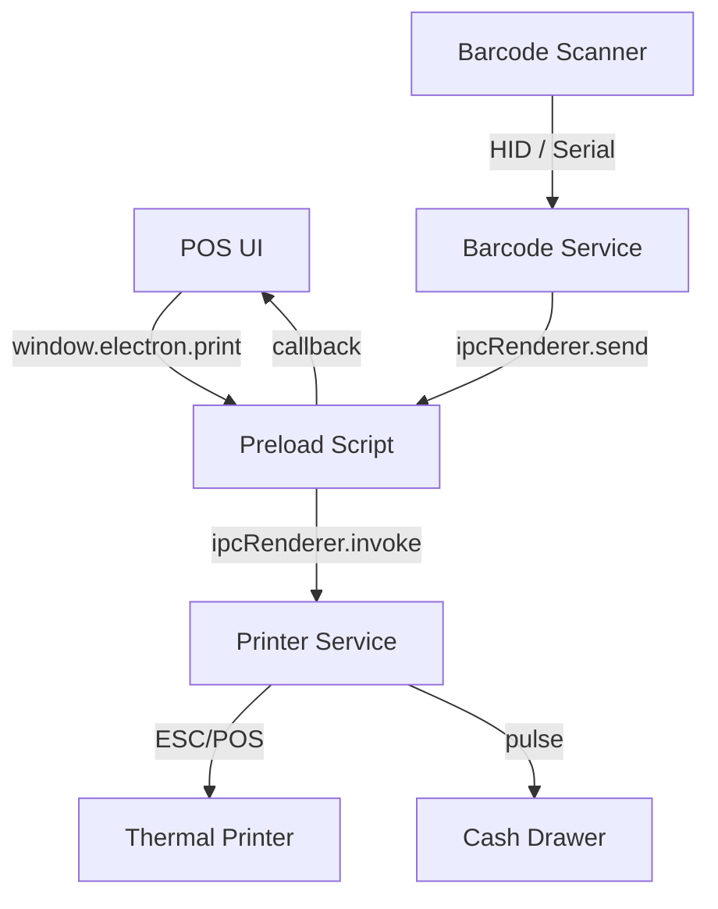
```mermaid
flowchart TB
    POS["POS UI"] -->|window.electron.print| Preload["Preload Script"]
    Preload -->|ipcRenderer.invoke| Printer["Printer Service"]
    Printer -->|ESC/POS| Thermal["Thermal Printer"]
    Printer -->|pulse| Drawer["Cash Drawer"]
    Scanner["Barcode Scanner"] -->|HID / Serial| Barcode["Barcode Service"]
    Barcode -->|ipcRenderer.send| Preload
    Preload -->|callback| POS
```

For setup details, see [docs/HARDWARE.md](docs/HARDWARE.md).

---

## Getting Started

### Prerequisites

- Node.js 20 or higher
- npm (or bun)
- Git
- A Supabase project
- (Optional) Docker

### Local Setup

```bash
# Clone the repository
git clone https://github.com/mateopiza/ai-point-of-sale.git
cd ai-point-of-sale

# Install dependencies
npm install

# Copy environment template
cp .env.example .env

# Start the dev server
npm run dev
```

The dev server starts at `http://localhost:8080`.

### Supabase Configuration

1. Create a project at [https://supabase.com](https://supabase.com).
2. Copy the **Project URL** and **anon public key** from Settings > API.
3. Fill them in `.env`:

```env
VITE_SUPABASE_URL=https://your-project.supabase.co
VITE_SUPABASE_PUBLISHABLE_KEY=your-anon-key
```

4. Link and push migrations:

```bash
supabase login
supabase link --project-ref your-project-ref
supabase db push
```

5. (Optional) Seed demo data:

```bash
supabase db reset
```

Default demo credentials:

- Email: `owner@demo.local`
- Password: `Demo2026!`

> Do not use demo credentials in production.

### Optional Integrations

#### Barcode Lookup

```env
VITE_BARCODE_LOOKUP_API_KEY=your-key
```

If not set, the app falls back to Open Food Facts.

#### OpenRouter (AI Agent)

Set as a Supabase Edge Function secret:

```bash
supabase secrets set OPENROUTER_API_KEY=your-key
```

#### Google Gemini (Invoice OCR)

```bash
supabase secrets set GEMINI_API_KEY=your-key
```

#### Rappi

```bash
supabase secrets set RAPPI_CLIENT_ID=your-id
supabase secrets set RAPPI_CLIENT_SECRET=your-secret
supabase secrets set RAPPI_WEBHOOK_SECRET=your-secret
supabase secrets set RAPPI_API_BASE=https://services.rappi.com
```

#### Evolution API (WhatsApp)

```bash
supabase secrets set EVOLUTION_API_URL=https://your-evolution-instance
supabase secrets set EVOLUTION_API_KEY=your-key
supabase secrets set EVOLUTION_WEBHOOK_SECRET=your-secret
```

### Running Tests

```bash
npm run test
npm run test:watch
npm run lint
npm run validate:migrations
npm run build
```

---

## Environment Variables

| Variable | Scope | Description |
|----------|-------|-------------|
| `VITE_SUPABASE_URL` | Build | Supabase project URL |
| `VITE_SUPABASE_PUBLISHABLE_KEY` | Build | Supabase anon public key |
| `VITE_BARCODE_LOOKUP_API_KEY` | Build | Barcode Lookup API key (optional) |
| `SUPABASE_URL` | Edge Function | Supabase URL for Edge Functions |
| `SUPABASE_ANON_KEY` | Edge Function | Supabase anon key for Edge Functions |
| `SUPABASE_SERVICE_ROLE_KEY` | Edge Function | Service role key for admin operations |
| `OPENROUTER_API_KEY` | Edge Function | OpenRouter API key |
| `GEMINI_API_KEY` | Edge Function | Google Gemini API key |
| `RAPPI_CLIENT_ID` | Edge Function | Rappi OAuth client ID |
| `RAPPI_CLIENT_SECRET` | Edge Function | Rappi OAuth client secret |
| `RAPPI_API_BASE` | Edge Function | Rappi API base URL |
| `RAPPI_WEBHOOK_SECRET` | Edge Function | Rappi webhook secret |
| `ALLOW_UNSIGNED_RAPPI_WEBHOOKS` | Edge Function | Allow unsigned webhooks for local testing |
| `RAPPI_IP_ALLOWLIST` | Edge Function | Comma-separated allowed IPs |
| `EVOLUTION_API_URL` | Edge Function | Evolution API base URL |
| `EVOLUTION_API_KEY` | Edge Function | Evolution API key |
| `EVOLUTION_WEBHOOK_SECRET` | Edge Function | Evolution webhook secret |
| `EVOLUTION_IP_ALLOWLIST` | Edge Function | Comma-separated allowed IPs |

> **Important:** `VITE_*` variables are embedded in the JavaScript bundle. Never put service-role keys or other secrets in a `VITE_*` variable.

---

## Deployment

### Docker

```bash
docker build \
  --build-arg VITE_SUPABASE_URL=https://your-project.supabase.co \
  --build-arg VITE_SUPABASE_PUBLISHABLE_KEY=your-anon-key \
  -t poss360t:latest .

docker run -p 3000:80 poss360t:latest
```

### Docker Compose per Tenant

Each tenant needs its own build because `VITE_*` variables are baked into the bundle.

```bash
cp -r deployments/_template deployments/instances/my-client
# Edit docker-compose.yml and .env.example
```

See [deployments/README.md](deployments/README.md) for Dokploy instructions.

### Electron Desktop

```bash
# Development
npm run dev:electron

# Build installer
npm run build:electron

# Build without packaging
npm run build:electron:dir
```

### PWA / Static Hosting

```bash
npm run build
```

Deploy the `dist/` folder to any static host.

---

## Development Guide

### Scripts

| Script | Purpose |
|--------|---------|
| `npm run dev` | Start Vite dev server |
| `npm run dev:electron` | Start Electron dev build |
| `npm run build` | Production web/PWA build |
| `npm run build:dev` | Development build (unminified) |
| `npm run build:electron` | Build Electron installer |
| `npm run preview` | Preview production build |
| `npm run test` | Run Vitest once |
| `npm run test:watch` | Run Vitest in watch mode |
| `npm run lint` | Run ESLint |
| `npm run validate:migrations` | Validate Supabase migration order |

### Code Style

- TypeScript strict mode is enabled.
- Use functional React components and hooks.
- UI components go in `src/components/ui/` or `src/components/shared/`.
- Business logic belongs in `src/modules/<feature>/`.
- Use Zustand for global client state and TanStack Query for server state.
- All Supabase queries must respect tenant and branch scoping.

---

## Troubleshooting

| Problem | Solution |
|---------|----------|
| `VITE_SUPABASE_URL is required` in Docker | Pass the build args correctly. |
| Login fails | Check that migrations and seed ran. |
| AI agent does not respond | Verify `OPENROUTER_API_KEY` is set as a Supabase secret. |
| Rappi webhooks return 401 | Check `RAPPI_WEBHOOK_SECRET`. |
| Offline sync not working | Verify IndexedDB is allowed in browser settings. |
| Printer not found (Electron) | Check Settings > Hardware. |
| Serial barcode scanner not reading | Verify COM port and baud rate. |

---

## Contributing

Contributions are welcome. Please read [CONTRIBUTING.md](CONTRIBUTING.md) for guidelines.

Quick start:

1. Fork the repository.
2. Create a feature branch: `git checkout -b feat/my-feature`.
3. Make your changes and add tests when possible.
4. Run `npm run lint`, `npm run test`, and `npm run build`.
5. Open a pull request.

For detailed docs, see the [`docs/`](docs/) folder:
[Architecture](docs/ARCHITECTURE.md) · [Flows](docs/FLOWS.md) · [Database](docs/DATABASE.md) · [Offline Sync](docs/OFFLINE_SYNC.md) · [AI Agent](docs/AI_AGENT.md) · [Security](docs/SECURITY.md) · [Hardware](docs/HARDWARE.md) · [Setup](docs/SETUP.md)

---

## License

This project is licensed under the [Apache License 2.0](LICENSE).

```text
Copyright 2026 POS S360T Contributors

Licensed under the Apache License, Version 2.0 (the "License");
you may not use this file except in compliance with the License.
You may obtain a copy of the License at

    http://www.apache.org/licenses/LICENSE-2.0
```

---

## Acknowledgments

Built by the POS S360T contributors. Originally developed by Soluciones 360 Tech.

This project would not be possible without the many open-source libraries that power it. See [NOTICE.md](NOTICE.md) for a list of major third-party dependencies and their licenses.

Special thanks to the teams behind React, Vite, Supabase, Tailwind CSS, Radix UI, shadcn/ui, Electron, and TanStack Query.
