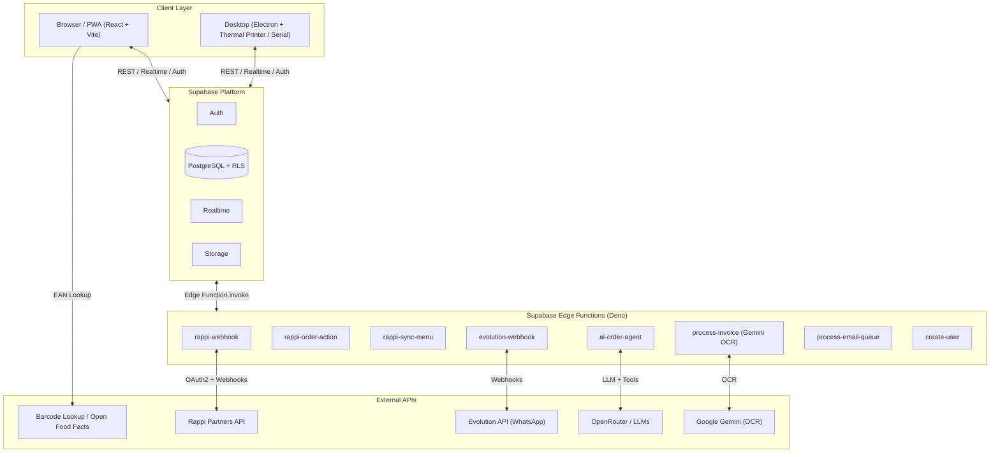
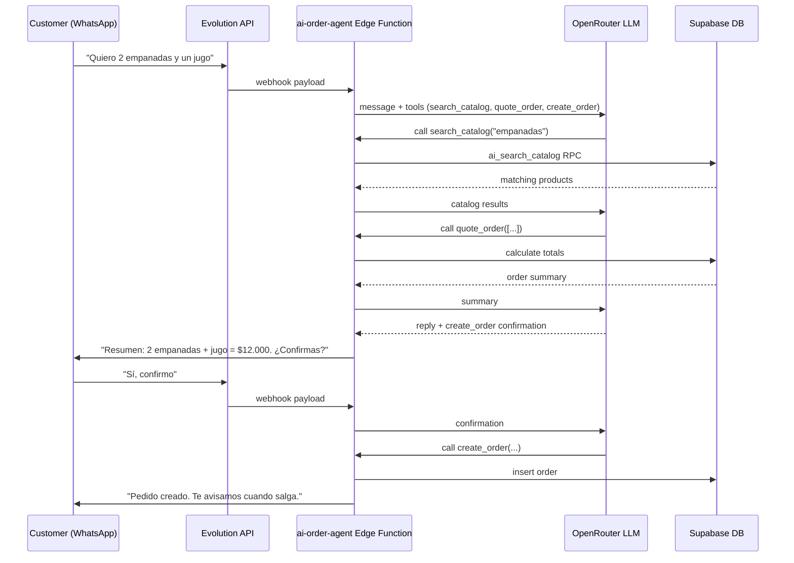
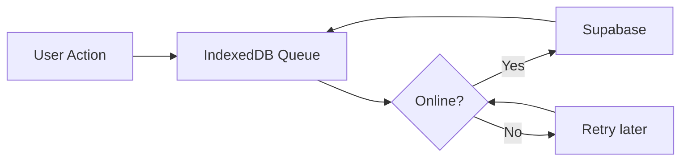

# POS S360T — AI-Powered, Offline-First Point of Sale

[](https://opensource.org/licenses/Apache-2.0)
[](https://react.dev)
[](https://www.typescriptlang.org)
[](https://vitejs.dev)
[](https://supabase.com)

> An open-source, multi-tenant, multi-channel POS system for retail and restaurants. Built with React, Supabase, and AI agents. Runs in the browser as a PWA, on desktop via Electron, and in Docker for self-hosting.

---

## Table of Contents

- [Overview](#overview)
- [Features](#features)
- [Screenshots](#screenshots)
- [Architecture](#architecture)
- [Tech Stack](#tech-stack)
- [Project Structure](#project-structure)
- [Getting Started](#getting-started)
- [Environment Variables](#environment-variables)
- [Deployment](#deployment)
- [Security & Secrets](#security--secrets)
- [AI Features](#ai-features)
- [Offline-First Sync](#offline-first-sync)
- [Multi-Tenancy](#multi-tenancy)
- [Contributing](#contributing)
- [License](#license)

---

## Overview

**POS S360T** is a modern point-of-sale platform designed for small and medium businesses that need more than a simple cash register. It supports multiple branches, real-time inventory, kitchen display systems (KDS), table service, delivery, digital orders from third-party platforms, and an AI agent that can take orders over WhatsApp.

The project is intentionally **offline-first**: sales, inventory movements, and other mutations are queued locally in the browser and synchronized with Supabase when connectivity returns.

For detailed documentation, see the [`docs/`](docs/) folder:
[Architecture](docs/ARCHITECTURE.md) · [Flows](docs/FLOWS.md) · [Database](docs/DATABASE.md) · [Offline Sync](docs/OFFLINE_SYNC.md) · [AI Agent](docs/AI_AGENT.md) · [Security](docs/SECURITY.md) · [Hardware](docs/HARDWARE.md) · [Setup](docs/SETUP.md)

---

## Features

| Module | Description |
|--------|-------------|
| **POS Terminal** | Fast sales with barcode scanning, cart, mixed payments, and cash register closeout. |
| **Inventory & Kardex** | Real-time stock tracking, storage centers, and warehouse transfers. |
| **Products & Catalog** | Products with recipes, combos, components, modifiers, and channel-specific pricing. |
| **Barcode Lookup** | Auto-fill product data by EAN using Barcode Lookup or Open Food Facts. |
| **Tables & KDS** | Table plan, kitchen tickets, waiter view, and dispatch workflow. |
| **Delivery Orders** | Register and track delivery orders with independent payments. |
| **Digital Orders** | Receive orders from delivery platforms (Rappi, Didi, Uber Eats). |
| **Rappi Integration** | Webhook receiver, menu sync, order accept/reject/ready/dispatch actions. |
| **Channel Pricing** | Different prices per sales channel (in-store, Rappi, Didi, Uber). |
| **Production / Kitchen** | Production orders and consumption tracking for prepared items. |
| **Cash Register** | Cash sessions, in/out movements, and closeout reconciliation. |
| **Expenses** | Operational expense tracking by category. |
| **Purchases** | Purchase orders to suppliers and returns. |
| **Customers** | Basic CRM with purchase history. |
| **Staff** | Employees, shifts, and attendance. |
| **Reports** | Sales, inventory, expenses, and margin reports by period. |
| **Invoice OCR** | Upload supplier invoices; Gemini extracts lines via Supabase Edge Function. |
| **Data Management** | Bulk import/export of products and inventory via CSV. |
| **WhatsApp AI Agent** | Conversational ordering, catalog search, and order creation over WhatsApp. |
| **QR Self-Ordering** | Public digital menu where customers order directly to a table or delivery. |
| **PWA** | Installable on mobile and desktop with offline support. |
| **Electron** | Desktop app with thermal printer, cash drawer, and serial barcode scanner support. |
| **Multi-Branch** | Independent prices, stock, and roles per branch. |
| **Multi-Tenant** | Domain-based tenant resolution and per-tenant branding. |

---

## Screenshots

> Replace the placeholders below with your own screenshots by dropping images into `docs/screenshots/` and updating the paths.

| Dashboard | POS Terminal | Inventory |
|-----------|--------------|-----------|
|  |  |  |

| Tables & KDS | WhatsApp AI Agent | Reports |
|--------------|-------------------|---------|
|  |  |  |

---

## Architecture



---

## Tech Stack

- **Frontend:** React 18, TypeScript, Vite 5
- **UI:** Tailwind CSS, Radix UI, shadcn/ui
- **State:** Zustand (client state), TanStack Query v5 (server state + IndexedDB persistence)
- **Backend:** Supabase (PostgreSQL, Auth, RLS, Realtime, Edge Functions)
- **Offline:** Dexie (IndexedDB) + custom sync queue
- **Desktop:** Electron + vite-plugin-electron
- **AI / LLM:** OpenRouter (Claude, GPT-4o, Gemini)
- **OCR:** Google Gemini
- **Barcode:** Barcode Lookup API + Open Food Facts fallback
- **PWA:** Vite PWA plugin + Workbox
- **Container:** Docker + nginx
- **Testing:** Vitest + React Testing Library

---

## Project Structure

```text
src/
├── components/
│   ├── layout/          # AppShell, ProtectedRoute, TenantProvider, Sidebar
│   ├── shared/          # Reusable widgets (MetricCard, OfflineBanner, etc.)
│   ├── ui/              # shadcn/ui primitives
│   └── pwa/             # PWA install prompt
├── hooks/               # Custom hooks (auth, tenant, sync, hardware, barcode)
├── lib/                 # Utilities (inventory, CSV, hardware, query client)
├── modules/             # Feature modules
│   ├── pos/
│   ├── inventory/
│   ├── products/
│   ├── tables/
│   ├── waiter/
│   ├── kds/
│   ├── delivery/
│   ├── digital-orders/
│   ├── production/
│   ├── cash/
│   ├── sales/
│   ├── reports/
│   ├── customers/
│   ├── suppliers/
│   ├── expenses/
│   ├── branches/
│   ├── staff/
│   ├── settings/
│   ├── catalog/
│   ├── channel-prices/
│   ├── whatsapp/
│   └── ai-agent/
├── pages/               # Top-level route pages
├── stores/              # Zustand stores (cart, tenant, network, theme)
├── types/               # Shared TypeScript types
├── integrations/supabase/
│   ├── client.ts        # Browser Supabase client
│   └── types.ts         # Generated database types
└── main.tsx             # App entry point

electron/                # Electron main process, preload, and services
supabase/
├── functions/           # Edge Functions (Deno)
├── migrations/          # PostgreSQL migrations
└── config.toml          # Local Supabase config (no secrets)
deployments/             # Per-customer Docker Compose templates
docs/                    # Runbooks and documentation
```

---

## Getting Started

### Prerequisites

- Node.js 20+
- npm or bun
- A Supabase project
- (Optional) Barcode Lookup API key, OpenRouter API key, Gemini API key

### Installation

```bash
# Clone the repository
git clone https://github.com/mateopiza/ai-point-of-sale.git
cd ai-point-of-sale

# Install dependencies
npm install

# Copy environment template
cp .env.example .env

# Start the dev server
npm run dev
```

The dev server starts at `http://localhost:8080`.

### Desktop development

```bash
npm run dev:electron
```

### Tests

```bash
npm run test
npm run test:watch
```

### Build

```bash
# Production web/PWA build
npm run build

# Development build (unminified)
npm run build:dev

# Electron build
npm run build:electron

# Electron build without packaging
npm run build:electron:dir
```

---

## Environment Variables

Copy `.env.example` to `.env` and fill in your own values.

| Variable | Description |
|----------|-------------|
| `VITE_SUPABASE_URL` | Your Supabase project URL |
| `VITE_SUPABASE_PUBLISHABLE_KEY` | Supabase `anon` public key |
| `VITE_BARCODE_LOOKUP_API_KEY` | Barcode Lookup API key (optional; Open Food Facts is used as fallback) |
| `OPENROUTER_API_KEY` | OpenRouter key for the WhatsApp AI agent |
| `GEMINI_API_KEY` | Google Gemini key for invoice OCR |
| `RAPPI_WEBHOOK_SECRET` | Rappi webhook signing secret |
| `ALLOW_UNSIGNED_RAPPI_WEBHOOKS` | Set to `true` only for local Rappi testing |
| `RAPPI_IP_ALLOWLIST` | Comma-separated IPs allowed to call the Rappi webhook |
| `EVOLUTION_WEBHOOK_SECRET` | Evolution API webhook secret |
| `EVOLUTION_IP_ALLOWLIST` | Comma-separated IPs for Evolution webhooks |
| `EVOLUTION_API_URL` | Evolution API base URL |
| `EVOLUTION_API_KEY` | Evolution API key |

> **Important:** Variables prefixed with `VITE_` are embedded in the JavaScript bundle at build time. Never put service-role keys or other secrets in a `VITE_` variable.

---

## Deployment

### Docker

```bash
docker build \
  --build-arg VITE_SUPABASE_URL=https://your-project.supabase.co \
  --build-arg VITE_SUPABASE_PUBLISHABLE_KEY=your-anon-key \
  -t poss360t:latest .

docker run -p 3000:80 poss360t:latest
```

### Multi-tenant deployment with Docker Compose

Each tenant/client can have its own compose file under `deployments/instances/<client>/`. See `deployments/_template/` for the base template.

```bash
cp -r deployments/_template deployments/instances/my-client
# Edit docker-compose.yml and .env.example
```

### Supabase migrations

```bash
supabase link --project-ref <ref>
supabase db push
```

---

## Security & Secrets

- **No API keys, passwords, or tokens are hard-coded in the source.** All secrets are read from environment variables.
- Row Level Security (RLS) is enabled on tenant-scoped tables.
- Webhook endpoints verify HMAC signatures and support IP allowlists.
- The `.env` file is ignored by Git. Never commit it.
- Seed migrations contain demo credentials clearly marked for development only. Change them before production use.

---

## AI Features

The WhatsApp AI agent can handle end-to-end conversational orders:



Knowledge documents can be uploaded per branch and embedded via OpenRouter for RAG-based responses.

---

## Offline-First Sync

The app stores pending mutations in IndexedDB (Dexie) and retries them when the browser comes back online:



All critical server operations are idempotent via `operation_log` checks.

---

## Multi-Tenancy

Tenants are resolved by domain. Each tenant has its own branches, users, products, prices, and inventory. RLS policies ensure users only see data for tenants and branches they belong to.

```text
customer-domain.com
    └── tenant_id (UUID)
            ├── branches[]
            ├── user_roles[]
            ├── products[]
            ├── product_channel_prices[]
            └── inventory_stocks[]
```

---

## Contributing

Contributions are welcome. Please read [CONTRIBUTING.md](CONTRIBUTING.md) for guidelines on issues, pull requests, and code style.

Quick start for contributors:

1. Fork the repository.
2. Create a feature branch: `git checkout -b feat/my-feature`.
3. Make your changes and add tests when possible.
4. Run `npm run lint`, `npm run test`, and `npm run build`.
5. Open a pull request.

---

## License

This project is licensed under the [Apache License 2.0](LICENSE).

```text
Copyright 2026 POS S360T Contributors

Licensed under the Apache License, Version 2.0 (the "License");
you may not use this file except in compliance with the License.
You may obtain a copy of the License at

    http://www.apache.org/licenses/LICENSE-2.0
```

---

## Acknowledgments

Built by the POS S360T contributors. Originally developed by Soluciones 360 Tech.
