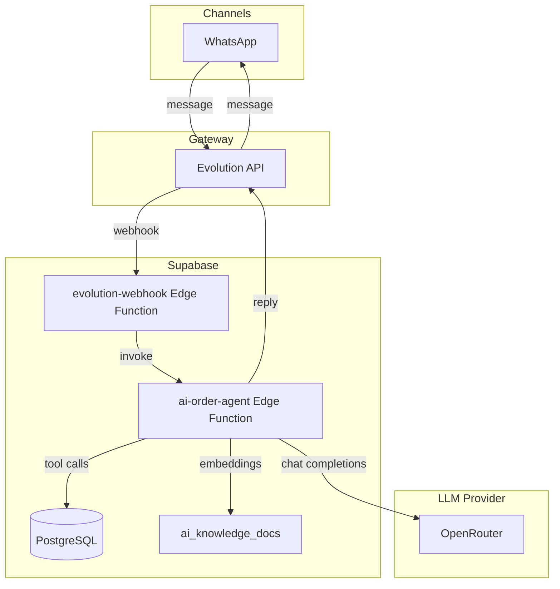

# AI Agent

The AI Agent enables conversational ordering through WhatsApp. Customers can ask questions, browse the catalog, get a quote, and place an order without human intervention.

---

## 1. Overview

---

## 2. Agent Capabilities

The agent exposes a set of tools to the LLM:

| Tool | Description |
|------|-------------|
| `search_catalog` | Search products by name, SKU, or barcode. |
| `quote_order` | Calculate the total for a list of items. |
| `create_order` | Create the final order after customer confirmation. |
| `handoff_to_human` | Escalate to a human operator. |

The agent only calls `create_order` after the customer confirms with words like "yes", "confirm", "ok", "listo", or "dale".

---

## 3. Configuration

Each branch can configure the agent in **Settings > AI Agent**:

- `system_prompt`: custom behavior instructions
- `ai_model`: LLM model via OpenRouter (Claude, GPT-4o, Gemini)
- `temperature`: creativity vs determinism
- `daily_recommendation`: product to suggest proactively
- `delivery_delay_minutes`: estimated delivery time

Configuration is stored in `ai_channel_configs`.

---

## 4. Knowledge Base (RAG)

Branches can upload knowledge documents (opening hours, policies, specials). The system:

1. Stores the document in `ai_knowledge_docs`.
2. Calls `embed-knowledge-doc` Edge Function to generate an embedding via OpenRouter.
3. Saves the embedding as a `vector` column.
4. The agent retrieves relevant documents by vector similarity during the conversation.

---

## 5. Conversation State

Conversations are tracked in `ai_conversations` and messages in `ai_messages`. This allows:

- context-aware multi-turn conversations,
- human handoff without losing history,
- analytics on agent performance.

Statuses:

- `open`: handled by AI
- `handoff`: transferred to human
- `closed`: finished

---

## 6. Security

- Webhook signatures from Evolution are verified with `EVOLUTION_WEBHOOK_SECRET`.
- IP allowlisting is supported via `EVOLUTION_IP_ALLOWLIST`.
- The agent validates the user's JWT before invoking tools.
- All database calls respect tenant and branch isolation.

---

## 7. Extending the Agent

To add a new tool:

1. Define the tool schema in `supabase/functions/ai-order-agent/index.ts`.
2. Implement the handler in the `tools` map.
3. Add a corresponding RPC if the tool needs database access.
4. Update the system prompt to mention when to use the new tool.

---

## 8. Models Supported

The default supported models are:

- `anthropic/claude-3.5-haiku`
- `anthropic/claude-3.5-sonnet`
- `openai/gpt-4o-mini`
- `openai/gpt-4o`
- `google/gemini-flash-1.5`

OpenRouter supports many more. You can add new models to `MODELS` in `src/modules/settings/AiAgentSettings.tsx`.
