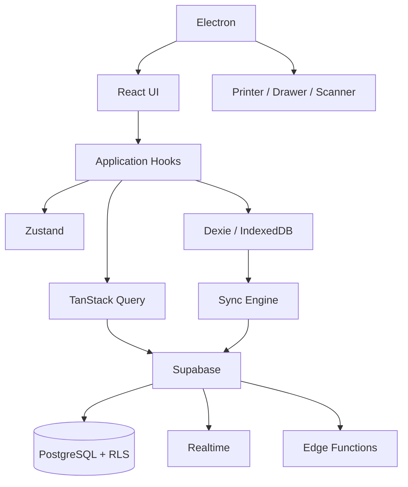

# ZAIPOS Architecture

ZAIPOS is an offline-first React/TypeScript point-of-sale platform for Bahrain businesses, backed by Supabase and optionally packaged with Electron.

## Runtime Layers

## Bahrain Configuration Boundary

Country-sensitive application defaults are centralized rather than scattered across feature modules. The shared Bahrain layer defines the supported locale, currency, standard VAT default, phone convention, and related formatting behavior.

Core defaults:

- `en-BH`
- `BHD`
- three decimal places
- standard VAT default 10%
- `+973` telephone convention

Feature modules should call shared formatting/normalization helpers rather than hard-code `$`, COP values, foreign phone formats, or non-Bahrain locale strings.

## Tenant and Branch Model

A business is a tenant. Operational data is scoped by `tenant_id`; branch-local data additionally uses `branch_id`. Authorization is enforced through Supabase Row Level Security and helper functions that evaluate tenant membership, role, and branch scope.

## Sales Channels

The active Bahrain channel model is:

- `pos` — Physical POS
- `tables` — Table service
- `talabat` — Bahrain marketplace ledger
- `whatsapp` — WhatsApp-assisted orders
- `delivery` — In-house delivery

Historical enum values may remain in PostgreSQL when destructive enum removal would be unsafe, but they are not exposed as active ZAIPOS channels.

## Payment Model

User-facing payments are Cash, Card, BenefitPay, and Bank Transfer.

For compatibility with existing accounting columns:

- BenefitPay uses the existing internal QR reconciliation bucket.
- Bank Transfer uses the existing transfer reconciliation bucket.

This prevents historical cash-session totals from being invalidated while keeping Bahrain-native terminology in the UI.

## Offline Architecture

ZAIPOS queues supported mutations in IndexedDB when the network is unavailable. The sync engine replays them when connectivity returns. Sensitive transactional flows use client mutation identifiers or equivalent idempotency controls to prevent duplicate writes.

## Electron Architecture

Electron provides:

- desktop packaging and installer identity;
- persistent local settings;
- thermal printer integration;
- cash drawer control;
- serial/barcode integration;
- application update plumbing.

Compatibility-sensitive local storage identifiers can remain internally where changing them would discard installed-device configuration. They must not appear as legacy product branding.

## Server-Side Integrations

Supabase Edge Functions handle operations that require server-side credentials or privileged access, including AI/WhatsApp workflows and invoice processing. ZAIPOS does not fabricate undocumented Talabat partner API contracts. Talabat orders are tracked as marketplace records unless an authorized documented integration is added.

## Security Boundaries

- Browser code uses only public client credentials.
- Service-role credentials remain server-side.
- RLS is the primary tenant-isolation boundary.
- RPC functions validate tenant/branch authorization for sensitive writes.
- Checkout and synchronization paths preserve idempotency.
- Production secrets and hard-coded demo passwords are prohibited.
