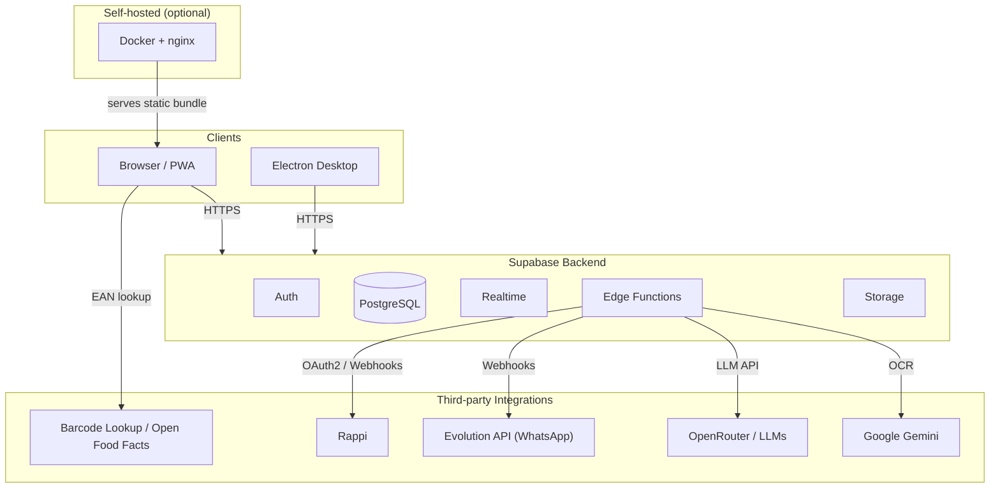
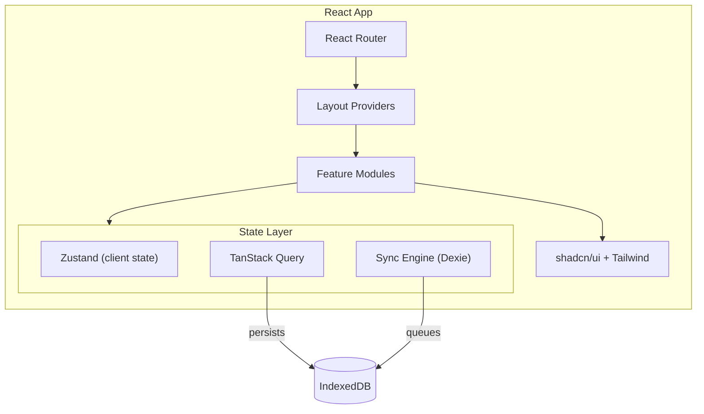
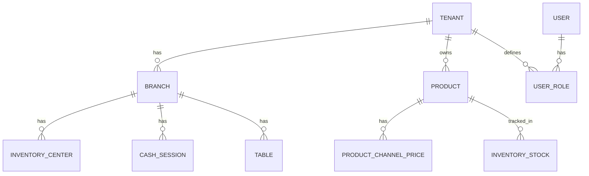

# Architecture

This document describes the high-level architecture of **POS S360T**. It is intended for contributors, operators, and architects who need to understand how the pieces fit together.

---

## 1. System Overview

POS S360T is a **multi-tenant, offline-first point-of-sale system**. It can run as:

- a **Progressive Web App (PWA)** in the browser,
- a **desktop application** via Electron,
- or a **self-hosted Docker container** behind nginx.

All three variants share the same React codebase and talk to the same Supabase backend.



---

## 2. Frontend Architecture

The frontend is a **single-page application (SPA)** built with Vite and React.



### Key responsibilities

| Layer | Responsibility |
|-------|----------------|
| `src/pages/` | Top-level route pages |
| `src/modules/` | Feature modules (POS, inventory, tables, etc.) |
| `src/components/ui/` | Low-level UI primitives from shadcn/ui |
| `src/components/shared/` | Reusable business widgets |
| `src/hooks/` | Data and domain hooks |
| `src/stores/` | Zustand stores (cart, tenant, network, theme) |
| `src/lib/` | Utilities and core business helpers |
| `src/integrations/supabase/` | Supabase client and generated types |

---

## 3. Backend Architecture

Supabase provides the backend as a managed Postgres service with authentication, realtime subscriptions, and serverless edge functions.

### 3.1 Database

PostgreSQL is the source of truth. Every tenant-scoped table has:

- a `tenant_id` column,
- Row Level Security (RLS) policies,
- indexes on `tenant_id`, `branch_id`, and common query fields.

### 3.2 Auth

Authentication uses Supabase Auth (JWT). Users can have multiple roles across tenants and branches. Roles include: `owner`, `admin`, `manager`, `cashier`, `kitchen`, `inventory`, `waiter`, `courier`, `staff`, and `super_admin`.

### 3.3 Realtime

Supabase Realtime is used for live updates in:

- Kitchen Display System (KDS)
- Table orders
- Digital order arrival
- WhatsApp conversation inbox

### 3.4 Edge Functions

Edge Functions run on Deno and handle operations that cannot be done securely from the browser:

| Function | Purpose |
|----------|---------|
| `ai-order-agent` | WhatsApp conversational AI agent |
| `embed-knowledge-doc` | Generate vector embeddings for RAG |
| `create-user` | Create auth users and assign roles |
| `process-invoice` | OCR supplier invoices with Gemini |
| `process-email-queue` | Process outgoing email queue |
| `rappi-webhook` | Receive Rappi order events |
| `rappi-order-action` | Accept/reject/ready/dispatch Rappi orders |
| `rappi-sync-menu` | Push menu to Rappi |
| `rappi-test-connection` | Validate Rappi credentials |
| `evolution-webhook` | Receive WhatsApp events from Evolution API |
| `send-whatsapp-message` | Send WhatsApp messages via Evolution API |

---

## 4. Multi-Tenancy Model



Tenants are resolved by the incoming domain (`tenant.domain`). The `TenantProvider` reads the hostname, looks up the tenant, and exposes `tenantId`, `branchId`, and user roles to the rest of the app.

---

## 5. Deployment Options

### 5.1 PWA / Static Hosting

Build the static bundle and serve it with any static host or with the included Docker + nginx setup.

### 5.2 Electron Desktop

Electron wraps the same bundle. The main process runs in Node.js and can access:

- thermal printers via `node-thermal-printer`,
- serial barcode scanners via `serialport`,
- cash drawers via printer pulse,
- auto-updater via `electron-updater`.

### 5.3 Docker Compose per Tenant

The `deployments/` folder contains templates for per-tenant Docker Compose stacks. Each tenant gets its own build because `VITE_*` variables are baked into the bundle.

---

## 6. Technology Decisions

| Decision | Rationale |
|----------|-----------|
| React + Vite | Fast build, modern dev experience, large ecosystem |
| Supabase | Managed Postgres + Auth + Realtime in one platform |
| TanStack Query + IndexedDB | Caching, persistence, and automatic background sync |
| Dexie | Easy IndexedDB API for offline mutation queue |
| Zustand | Lightweight global state |
| Edge Functions | Secure server-side operations without managing servers |
| Electron | Access to hardware peripherals not available in browsers |
| PWA | Installable, works offline, no store approval needed |
| OpenRouter | Unified API for multiple LLM providers |

---

## 7. Directory Map

```text
src/
├── components/        # UI components
├── hooks/             # React hooks
├── integrations/      # Supabase client and types
├── lib/               # Business utilities
├── modules/           # Feature modules
├── pages/             # Route pages
├── stores/            # Zustand stores
├── types/             # Shared types
└── main.tsx           # Entry point

electron/              # Desktop app
supabase/
├── functions/         # Edge Functions
├── migrations/        # SQL schema
└── config.toml        # Local CLI config

deployments/           # Docker Compose templates
docs/                  # Documentation
public/                # Static assets
```
