# Database Guide

This document describes the core database schema, Row Level Security (RLS) model, and key RPC functions.

---

## 1. Design Principles

- **Tenant isolation**: Every tenant-scoped table has `tenant_id` and RLS policies.
- **Branch scoping**: Many entities also have `branch_id` for branch-level data.
- **Kardex pattern**: All inventory changes are recorded in `inventory_movements`.
- **Idempotency**: Critical mutations check `operation_log` before executing.
- **Auditability**: `audit_logs` tracks user actions; `operation_log` tracks technical idempotency.

---

## 2. Core Entity Diagram

```mermaid
erDiagram
    TENANTS {
        uuid id PK
        string name
        string slug UK
        string domain
        string currency
        float tax_rate
        string primary_color
        string theme_kind
    }

    BRANCHES {
        uuid id PK
        uuid tenant_id FK
        string name
        string address
        string phone
    }

    PROFILES {
        uuid id PK
        string email
        jsonb raw_user_meta_data
    }

    USER_ROLES {
        uuid id PK
        uuid user_id FK
        uuid tenant_id FK
        uuid branch_id FK
        app_role role
    }

    CATEGORIES {
        uuid id PK
        uuid tenant_id FK
        string name
        string color
    }

    PRODUCTS {
        uuid id PK
        uuid tenant_id FK
        uuid category_id FK
        string name
        string barcode
        string sku
        float price
        float cost
        product_type type
    }

    PRODUCT_CHANNEL_PRICES {
        uuid id PK
        uuid tenant_id FK
        uuid product_id FK
        string channel
        float price
    }

    INVENTORY_CENTERS {
        uuid id PK
        uuid tenant_id FK
        uuid branch_id FK
        string name
        string type
    }

    INVENTORY_STOCKS {
        uuid id PK
        uuid tenant_id FK
        uuid branch_id FK
        uuid product_id FK
        uuid inventory_center_id FK
        float quantity
    }

    INVENTORY_MOVEMENTS {
        uuid id PK
        uuid tenant_id FK
        uuid branch_id FK
        uuid product_id FK
        uuid inventory_center_id FK
        string movement_type
        float quantity
        float unit_cost
        string reference_type
        uuid reference_id
    }

    SALES {
        uuid id PK
        uuid tenant_id FK
        uuid branch_id FK
        uuid cash_session_id FK
        string channel
        float total
        float tax
        string status
    }

    SALE_ITEMS {
        uuid id PK
        uuid sale_id FK
        uuid product_id FK
        float quantity
        float unit_price
        jsonb modifiers
    }

    PAYMENTS {
        uuid id PK
        uuid sale_id FK
        string method
        float amount
    }

    TABLES {
        uuid id PK
        uuid tenant_id FK
        uuid branch_id FK
        string name
        int capacity
        string status
    }

    TABLE_ORDERS {
        uuid id PK
        uuid tenant_id FK
        uuid branch_id FK
        uuid table_id FK
        string status
        float total
    }

    TABLE_ORDER_ITEMS {
        uuid id PK
        uuid table_order_id FK
        uuid product_id FK
        float quantity
        string status
    }

    CASH_SESSIONS {
        uuid id PK
        uuid tenant_id FK
        uuid branch_id FK
        uuid cash_register_id FK
        float opening_amount
        float closing_amount
        string status
    }

    DIGITAL_ORDERS {
        uuid id PK
        uuid tenant_id FK
        uuid branch_id FK
        string platform
        string external_order_id
        string external_status
        jsonb external_payload
    }

    PRODUCTION_ORDERS {
        uuid id PK
        uuid tenant_id FK
        uuid branch_id FK
        uuid product_id FK
        float quantity_produced
        string status
    }

    AI_CONVERSATIONS {
        uuid id PK
        uuid tenant_id FK
        uuid branch_id FK
        string channel
        string customer_phone
        string status
    }

    AI_KNOWLEDGE_DOCS {
        uuid id PK
        uuid tenant_id FK
        uuid branch_id FK
        string title
        text content
        vector embedding
    }

    TENANTS ||--o{ BRANCHES : has
    TENANTS ||--o{ PRODUCTS : owns
    TENANTS ||--o{ CATEGORIES : owns
    PRODUCTS ||--o{ PRODUCT_CHANNEL_PRICES : priced_for
    PRODUCTS ||--o{ INVENTORY_STOCKS : stocked_as
    INVENTORY_CENTERS ||--o{ INVENTORY_STOCKS : holds
    PRODUCTS ||--o{ INVENTORY_MOVEMENTS : moved_in
    SALES ||--o{ SALE_ITEMS : contains
    SALES ||--o{ PAYMENTS : paid_with
    TABLES ||--o{ TABLE_ORDERS : has
    TABLE_ORDERS ||--o{ TABLE_ORDER_ITEMS : contains
    BRANCHES ||--o{ CASH_SESSIONS : has
```



---

## 3. Row Level Security (RLS)

Every tenant-scoped table enables RLS. Example pattern:

```sql
CREATE POLICY "tenant_isolation" ON products
FOR ALL
TO authenticated
USING (tenant_id IN (
  SELECT tenant_id FROM user_roles WHERE user_id = auth.uid()
));
```

For branch-scoped tables, policies also check `branch_id` against the user's allowed branches.

Special roles:

- `super_admin` can access all tenants.
- `owner` and `admin` can manage all branches of a tenant.
- Branch-specific roles (`cashier`, `waiter`, `courier`, etc.) are restricted to their assigned branch.

---

## 4. Key RPC Functions

### Inventory

| Function | Purpose |
|----------|---------|
| `apply_inventory_movement` | Atomic stock movement and kardex record. The only way to change stock. |
| `transfer_inventory` | Transfer stock between inventory centers. |
| `audit_inventory_drift` | Reconcile missing stock for active products. |

### Sales

| Function | Purpose |
|----------|---------|
| `checkout_sale` | Close a POS sale with items, modifiers, and payments. |
| `checkout_table_order` | Close a table order with payments. |
| `register_delivery_order` | Create a delivery order. |
| `register_delivery_payment` | Record a delivery payment. |
| `update_delivery_status` | Update delivery status. |
| `register_digital_order` | Insert an order from a digital platform. |

### Tables / KDS

| Function | Purpose |
|----------|---------|
| `send_table_order_to_kitchen` | Send a table order to the kitchen. |
| `dispatch_table_item` | Mark a table item as dispatched. |
| `undispatch_table_item` | Revert a dispatched item. |
| `mark_table_item_ready` | Mark a table item as ready. |
| `mark_table_order_ready` | Mark the whole order as ready. |
| `start_preparing_table_item` | Start preparing an item. |
| `recalc_table_order` | Recalculate table order totals. |

### Cash

| Function | Purpose |
|----------|---------|
| `close_cash_session` | Close and reconcile a cash session. |
| `add_cash_movement` | Add a cash in/out movement. |

### Production

| Function | Purpose |
|----------|---------|
| `complete_production_order` | Complete a production order and apply consumptions. |

### AI / Catalog

| Function | Purpose |
|----------|---------|
| `ai_search_catalog` | Semantic + text search of products for the AI agent. |
| `get_branch_menu` | Optimized menu for QR/catalog. |
| `get_branch_menu_v2` | Extended menu with modifiers. |
| `create_qr_order` | Create an order from the QR self-ordering flow. |

### Email

| Function | Purpose |
|----------|---------|
| `enqueue_email` | Add an email to the queue. |
| `read_email_batch` | Read pending emails for processing. |
| `delete_email` | Delete a processed email. |
| `move_to_dlq` | Move a failed email to the dead-letter queue. |

### Permissions

| Function | Purpose |
|----------|---------|
| `has_role` | Check if user has a specific role in a tenant/branch. |
| `has_any_role` | Check if user has any of the given roles. |
| `has_branch_role` | Check role scoped to a branch. |
| `is_tenant_member` | Check if user belongs to a tenant. |

---

## 5. Enums and Custom Types

| Type | Values |
|------|--------|
| `app_role` | `owner`, `admin`, `manager`, `cashier`, `kitchen`, `inventory`, `waiter`, `courier`, `staff`, `super_admin` |
| `product_type` | `simple`, `composite`, `combo` |
| `inventory_center_type` | `point_of_sale`, `warehouse`, `production` |
| `movement_type` | `purchase`, `sale`, `adjustment`, `transfer_in`, `transfer_out`, `production_in`, `production_out`, `waste` |
| `sale_status` | `pending`, `paid`, `cancelled`, `refunded` |
| `table_order_status` | `open`, `sent_to_kitchen`, `ready`, `dispatched`, `closed`, `cancelled` |

---

## 6. Migrations

Migrations live in `supabase/migrations/` and should be applied in order. To validate migration consistency locally:

```bash
npm run validate:migrations
```

To deploy to a Supabase project:

```bash
supabase link --project-ref <your-ref>
supabase db push
```

---

## 7. Seeding

The repository includes seed data for local development:

- `supabase/seed.sql` — local demo tenant "La Panadería" with products and an owner user.
- `supabase/migrations/20260508120000_seed_panaderia_tenant.sql` — production-style seed.
- `supabase/migrations/20260508130000_seed_panaderia_demo_users.sql` — demo users per role.

> **Warning:** Demo seeds contain weak passwords intended for development only. Change them before production use.
