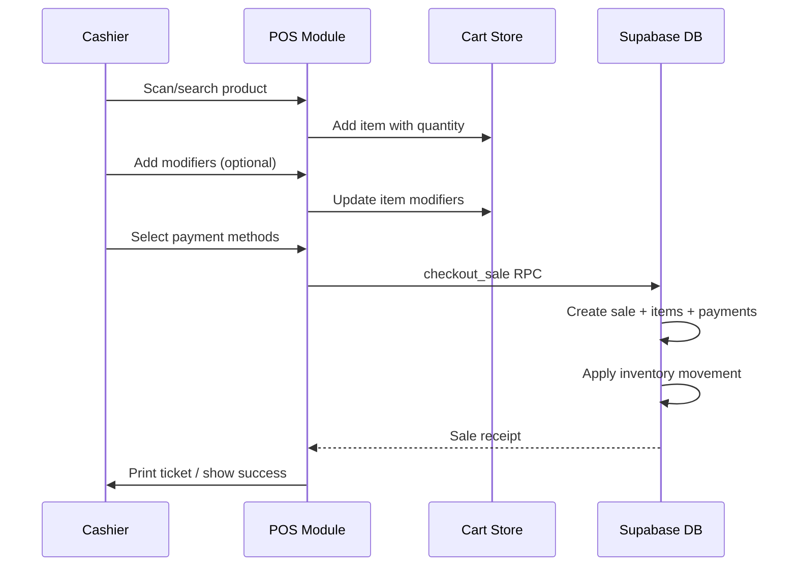
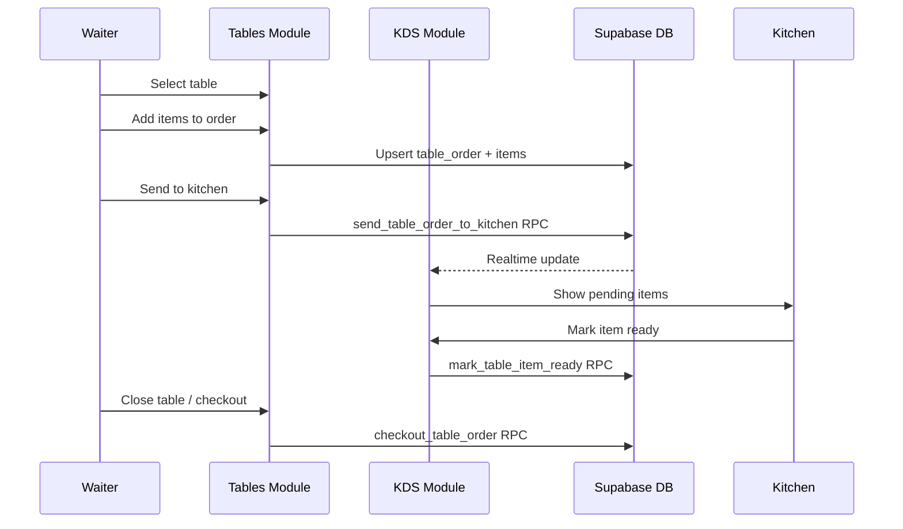
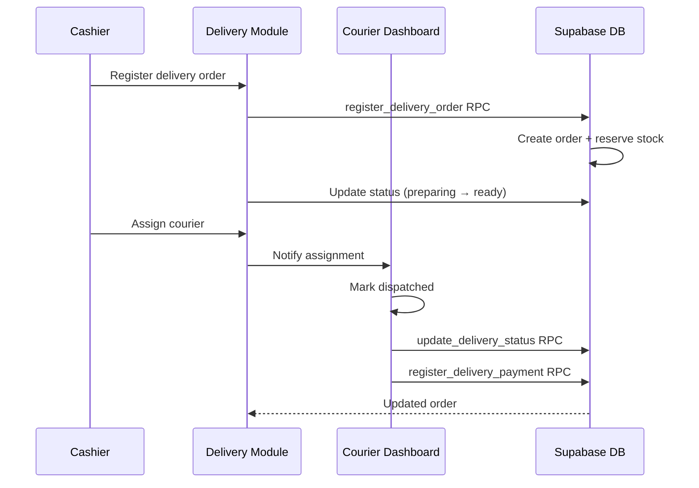
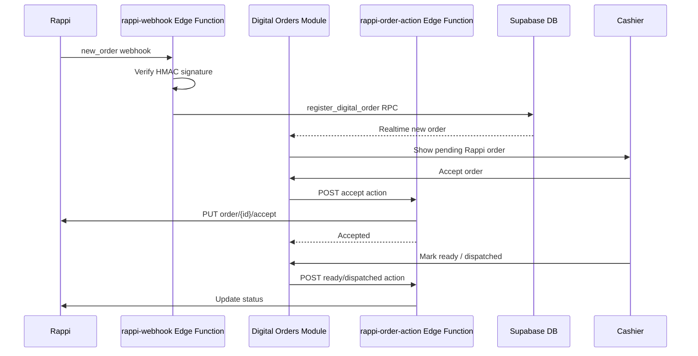
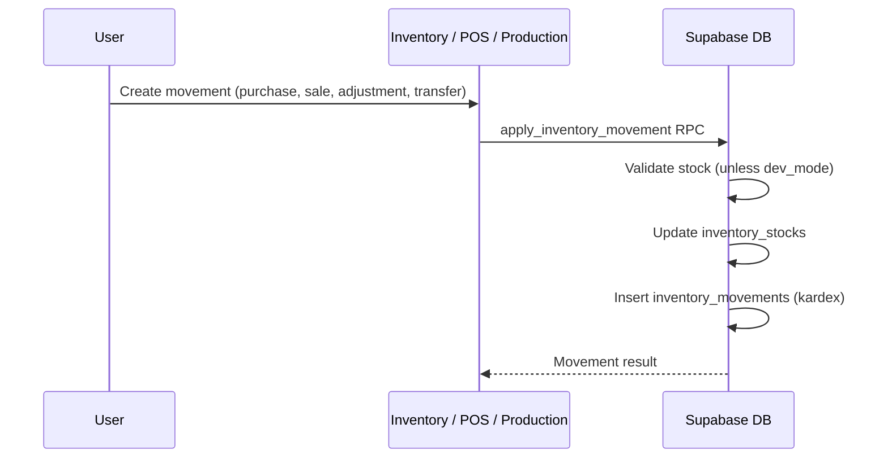
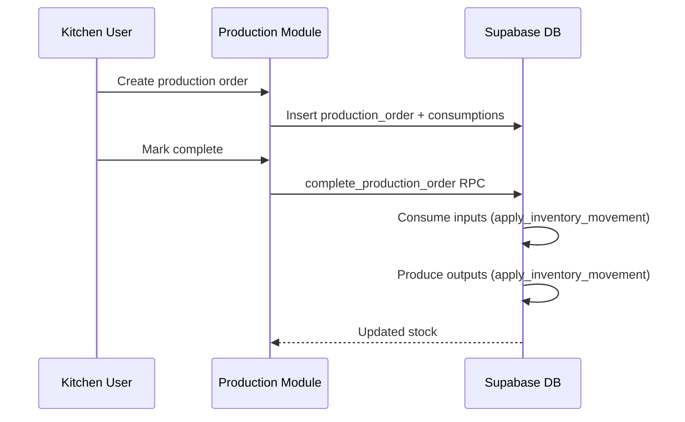
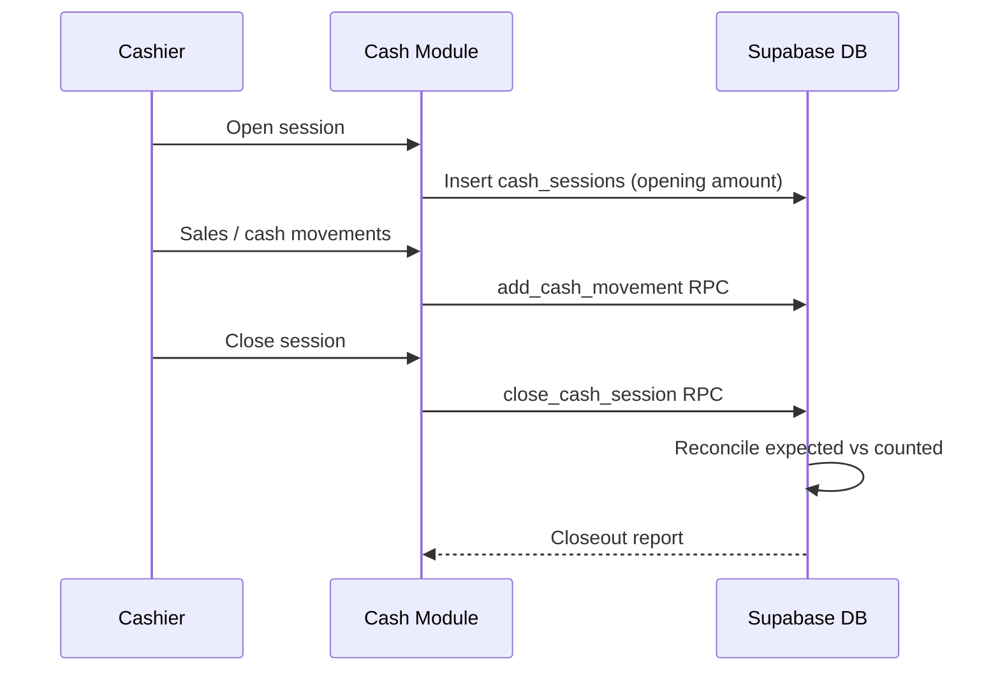
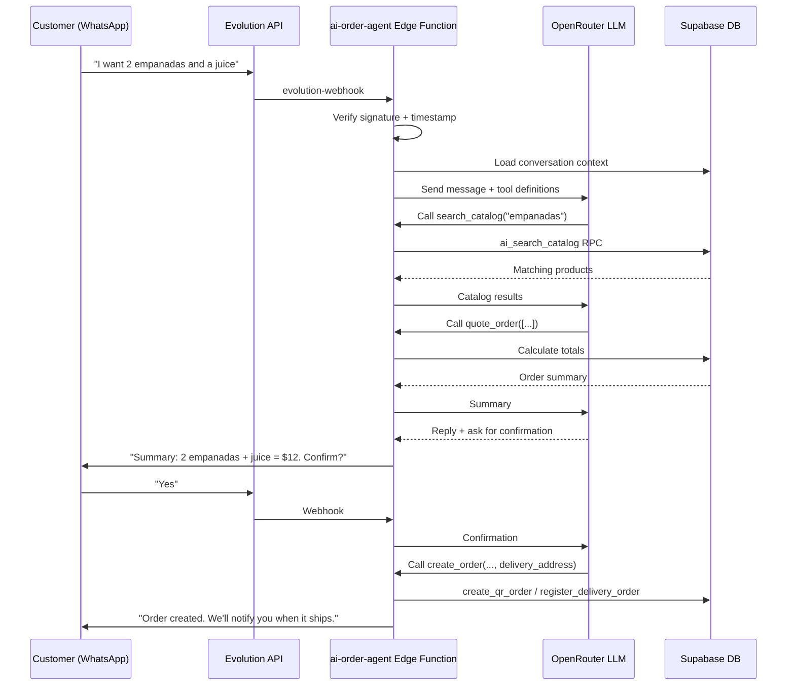
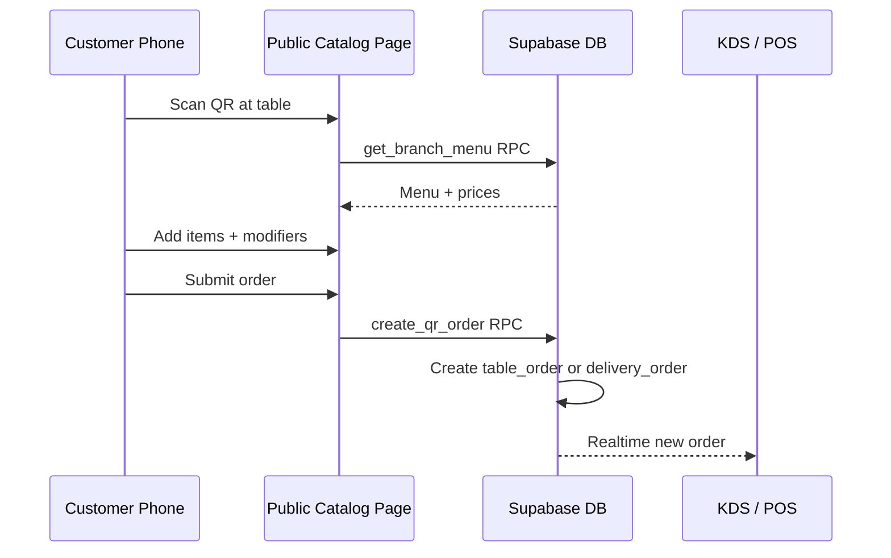
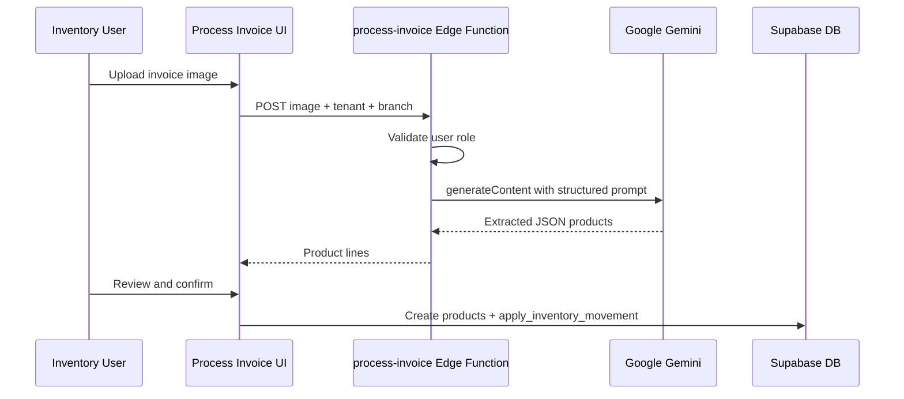

# Business Flows

This document describes the main business flows of POS S360T. Each flow is presented as a sequence diagram so operators and contributors can understand the order of operations and the systems involved.

---

## 1. Quick Sale (POS Terminal)

A cashier scans or searches products, applies modifiers, selects payment methods, and closes the sale.

---

## 2. Table Service and Kitchen Display System (KDS)

Waiters take orders by table. Items are sent to the kitchen, prepared, and dispatched.

---

## 3. Delivery Order

A delivery order is registered, prepared, assigned to a courier, and paid.

---

## 4. Rappi Digital Order

Rappi sends orders via webhook. The POS accepts or rejects them and updates status back to Rappi.

---

## 5. Inventory Movement

All stock changes go through `apply_inventory_movement`. This ensures the kardex is always consistent.

---

## 6. Production / Kitchen Order

A production order consumes raw materials and produces finished goods.

---

## 7. Cash Register Session

A cashier opens a session, sells, moves cash in/out, and closes with reconciliation.

---

## 8. WhatsApp AI Order Agent

Customers order through WhatsApp. The AI agent uses tools to search the catalog, quote, and create orders.

---

## 9. QR Self-Ordering

Customers scan a QR code, see the digital menu, and place an order directly.

---

## 10. Invoice OCR

A user uploads a supplier invoice image and the system extracts line items with Gemini.

---

## Flow Summary Table

| Flow | Entry Point | Key RPC / Function |
|------|-------------|--------------------|
| Quick sale | `/pos` | `checkout_sale` |
| Table order | `/tables/:id` | `checkout_table_order` |
| Delivery | `/delivery` | `register_delivery_order` |
| Rappi order | `rappi-webhook` Edge Function | `register_digital_order` |
| Inventory movement | `/inventory` | `apply_inventory_movement` |
| Production | `/production` | `complete_production_order` |
| Cash session | `/cash` | `close_cash_session` |
| WhatsApp order | `evolution-webhook` → `ai-order-agent` | `create_qr_order` / `register_delivery_order` |
| QR order | `/qr-menu` | `create_qr_order` |
| Invoice OCR | `/inventory` → upload | `process-invoice` Edge Function |
