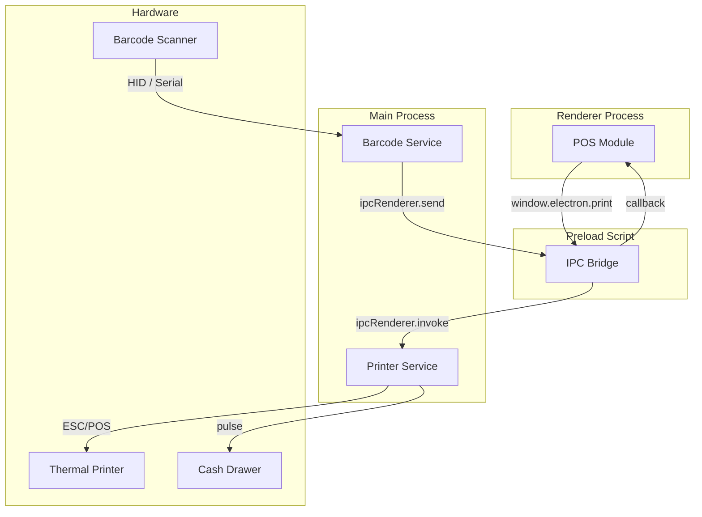

# Hardware Integration

This document describes how POS S360T integrates with physical hardware in the Electron desktop build.

---

## 1. Supported Hardware

| Device | Interface | Use Case |
|--------|-----------|----------|
| Thermal printer | USB (ESC/POS) | Print sales tickets and receipts |
| Cash drawer | USB printer pulse | Open cash drawer after sale |
| Barcode scanner | HID keyboard or Serial | Scan product barcodes |

---

## 2. Electron Architecture



---

## 3. Thermal Printer

The printer service uses `node-thermal-printer` to communicate with ESC/POS printers.

Features:

- Print sales receipts with business branding
- Print kitchen tickets
- Open cash drawer
- Detect printer connection status

Configuration is in **Settings > Hardware**.

---

## 4. Barcode Scanner

Two modes are supported:

### HID Keyboard Mode

The scanner emulates a keyboard. The app detects rapid keystrokes (less than 50 ms between characters) and routes them to the active barcode input.

### Serial Mode

The scanner is connected via a COM/USB serial port. Only available in Electron. Configure the port and baud rate in **Settings > Hardware**.

---

## 5. Cash Drawer

The cash drawer is opened by sending a pulse command through the thermal printer. This is triggered automatically after a cash sale or manually from the POS.

---

## 6. Building the Desktop App

```bash
# Development
npm run dev:electron

# Build installer
npm run build:electron

# Build without packaging
npm run build:electron:dir
```

The Electron build is configured in `electron-builder.config.json`.

---

## 7. Troubleshooting

| Issue | Possible Cause | Solution |
|-------|--------------|----------|
| Printer not found | Wrong printer selected | Check Settings > Hardware |
| Drawer does not open | Printer not connected | Verify printer USB connection |
| Barcode not captured | Scanner in wrong mode | Switch between HID and Serial |
| Serial scanner not reading | Wrong COM port | Check device manager / `dmesg` |

---

## 8. Extending Hardware Support

To add a new hardware integration:

1. Add the Node.js library to `dependencies` in `package.json`.
2. Create a service in `electron/services/`.
3. Expose safe methods in `electron/preload.ts`.
4. Add a hook in `src/hooks/` for the React side.
5. Add configuration UI in **Settings > Hardware**.
