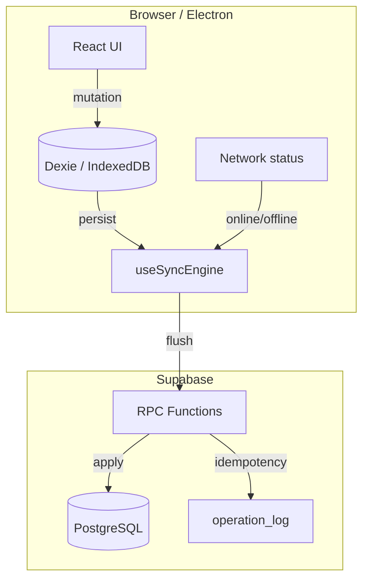
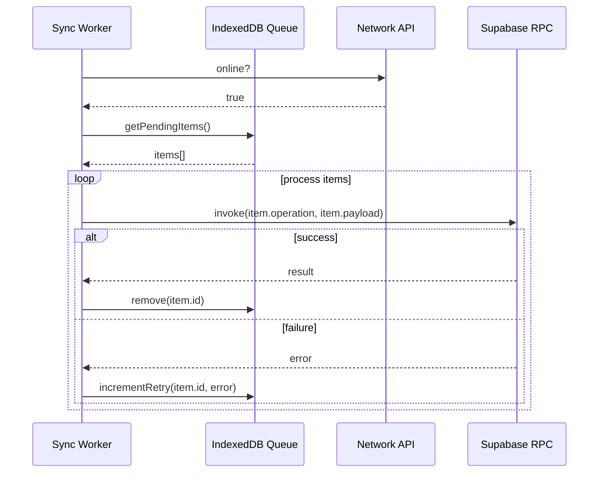

# Offline-First Sync

POS S360T is designed to keep working when the internet connection is unstable or unavailable. This document explains how the offline-first architecture works.

---

## 1. Goals

- Cashiers can continue selling even without connectivity.
- Inventory movements, table orders, and other mutations are not lost.
- When connectivity returns, pending changes sync automatically.
- Sync is safe: duplicate operations are prevented by idempotency checks.

---

## 2. Architecture



---

## 3. Mutation Queue

When a user performs an action that requires the server (for example, closing a sale), the mutation is wrapped by `useOfflineMutation`:

1. If online, the mutation is sent immediately.
2. If offline, the mutation is stored in IndexedDB via Dexie.
3. A sync engine watches network status and retries queued mutations.

### Queue item structure

```ts
interface SyncQueueItem {
  id: string;               // UUID
  operation: string;        // e.g. "checkout_sale"
  payload: object;          // RPC arguments
  entity_type?: string;     // e.g. "sale"
  entity_id?: string;       // local optimistic ID
  retry_count: number;
  created_at: string;
  error?: string;
}
```

---

## 4. Sync Engine

`useSyncEngine` (in `src/hooks/useSyncEngine.ts`) performs the following loop:

1. Listen for `online` / `offline` browser events.
2. When online, read pending items from IndexedDB.
3. Process items in submission order.
4. For each item, call the appropriate RPC or Supabase function.
5. On success, remove the item from the queue.
6. On failure, increment `retry_count` and store the error.
7. Stop after a maximum number of retries to avoid infinite loops.



---

## 5. Idempotency

The `operation_log` table prevents duplicate mutations when a request is retried.

Most write RPCs accept an `idempotency_key` (often the queue item's `id`). The server checks `operation_log` before executing:

```sql
INSERT INTO operation_log (idempotency_key, operation, payload)
VALUES (..., ..., ...)
ON CONFLICT (idempotency_key) DO NOTHING
RETURNING *;
```

If the key already exists, the RPC returns the previously stored result instead of re-executing.

---

## 6. Optimistic UI

Some UI actions show optimistic updates before the server confirms:

- Cart updates are local until checkout.
- Table order items update the UI immediately and sync in the background.
- Offline banners inform users when the app is disconnected.

---

## 7. Data Persistence

TanStack Query caches server data in IndexedDB via `@tanstack/query-async-storage-persister`. This means:

- Recently viewed products, sales, and inventory are available offline.
- When the app restarts offline, it can still render the last known data.

---

## 8. Conflict Handling

The current strategy is **last-write-wins** at the entity level, protected by idempotency keys. For inventory specifically, all movements go through `apply_inventory_movement`, which is atomic and serialized per product/center.

For future improvements, consider:

- Operational transformation for concurrent table orders.
- Server-side conflict detection for cash sessions.
- Vector clocks or CRDTs for highly partitioned deployments.

---

## 9. Testing Offline Behavior

To simulate offline mode during development:

1. Open the browser DevTools.
2. Go to the **Network** tab.
3. Set throttling to **Offline**.
4. Perform actions in the POS.
5. Restore connectivity and watch the sync engine process the queue.

In Electron, disconnect the machine from the network and repeat the same steps.

---

## 10. Limitations

- Realtime subscriptions do not work offline.
- Some reports require server-side aggregation and are unavailable offline.
- External integrations (Rappi, WhatsApp) require connectivity.
- Printing in Electron requires the printer to be connected locally.
