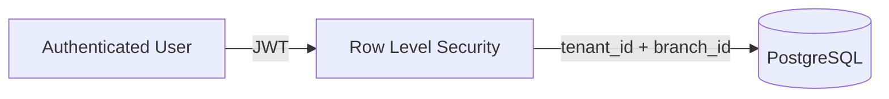

# Security

This document describes the security model of POS S360T and how secrets are managed.

---

## 1. Threat Model

POS S360T handles sales, inventory, customer data, and third-party integrations. Key concerns:

- Tenant data isolation
- Protection of API keys and webhook secrets
- Safe handling of customer phone numbers and emails
- Prevention of duplicate or fraudulent transactions
- Secure access to hardware peripherals in Electron

---

## 2. Tenant and Branch Isolation

Every tenant-scoped table has RLS policies. Users can only read or write rows where:

- `tenant_id` matches one of their assigned tenants, and
- `branch_id` matches one of their assigned branches (for branch-scoped tables).

The `super_admin` role bypasses tenant isolation for platform administration.

---

## 3. Secrets Management

All secrets are read from environment variables. No secrets are committed to the repository.

### Frontend build-time variables (`VITE_*`)

These are embedded in the JavaScript bundle:

- `VITE_SUPABASE_URL`
- `VITE_SUPABASE_PUBLISHABLE_KEY`
- `VITE_BARCODE_LOOKUP_API_KEY` (optional)

> Never put service-role keys or private API keys in a `VITE_*` variable.

### Edge Function secrets

These are configured in Supabase Dashboard or via the Supabase CLI:

- `SUPABASE_URL`
- `SUPABASE_ANON_KEY`
- `SUPABASE_SERVICE_ROLE_KEY`
- `OPENROUTER_API_KEY`
- `GEMINI_API_KEY`
- `RAPPI_CLIENT_ID`
- `RAPPI_CLIENT_SECRET`
- `RAPPI_WEBHOOK_SECRET`
- `EVOLUTION_API_URL`
- `EVOLUTION_API_KEY`
- `EVOLUTION_WEBHOOK_SECRET`

### Local development

Copy `.env.example` to `.env` and fill in your values. `.env` is ignored by Git.

---

## 4. Webhook Security

### Rappi

- Verifies `X-Rappi-Signature` using HMAC-SHA256.
- Validates `X-Rappi-Timestamp` freshness (5-minute window).
- Rate-limits by IP.
- Supports optional IP allowlist (`RAPPI_IP_ALLOWLIST`).

### Evolution (WhatsApp)

- Verifies `x-webhook-signature` or `x-evolution-signature`.
- Validates timestamp freshness.
- Rate-limits by IP.
- Supports optional IP allowlist (`EVOLUTION_IP_ALLOWLIST`).

---

## 5. Idempotency

Critical write operations use idempotency keys to prevent duplicate execution on retries. The `operation_log` table stores:

- idempotency key
- operation name
- payload hash
- result
- timestamp

If the same key is received again, the stored result is returned without re-executing the operation.

---

## 6. Input Validation

- Zod schemas validate forms on the frontend.
- RPC functions validate required fields and roles on the backend.
- Edge Functions validate JWTs and payload shape before processing.

---

## 7. Reporting Security Issues

If you discover a security vulnerability, please do not open a public issue. Contact the maintainers privately with details and reproduction steps.

---

## 8. Security Checklist for Production

- [ ] Rotate all demo seed passwords.
- [ ] Use strong Supabase database password.
- [ ] Enable RLS on all tenant tables.
- [ ] Disable `ALLOW_UNSIGNED_RAPPI_WEBHOOKS` in production.
- [ ] Configure webhook IP allowlists.
- [ ] Use HTTPS everywhere.
- [ ] Keep dependencies updated.
- [ ] Review Edge Function CORS settings.
- [ ] Enable Supabase MFA for project members.
- [ ] Set up audit logging and alerting.
