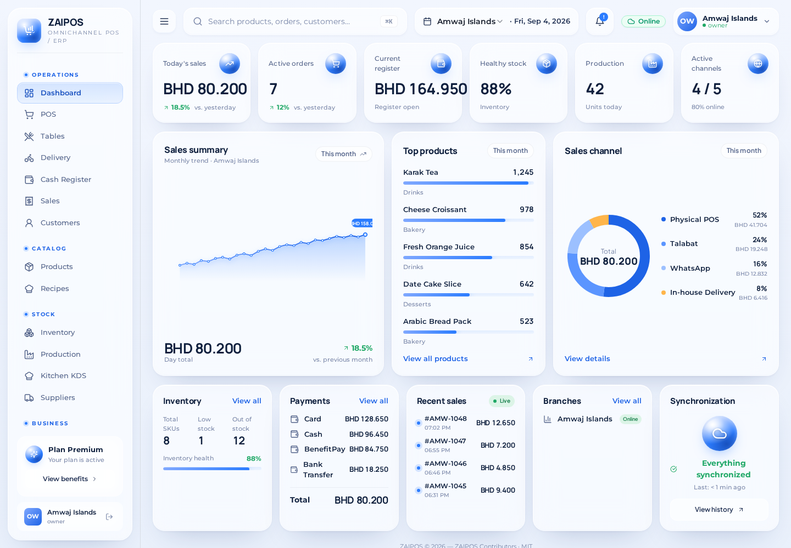
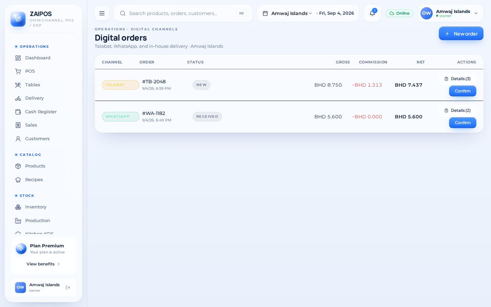

# ZAIPOS Screenshots

These screenshots are generated from the current ZAIPOS React routes with deterministic Bahrain demonstration data. They are documentation fixtures only: no production customer, payment, authentication, or business records are used.

Every published capture must show ZAIPOS branding, English user-facing text, Bahrain context, BHD formatting with three decimal places where money is visible, and Bahrain-supported payment/channel terminology.

## Landing

## Dashboard

## POS — Desktop

## POS — Mobile

## Digital Orders

## Settings

