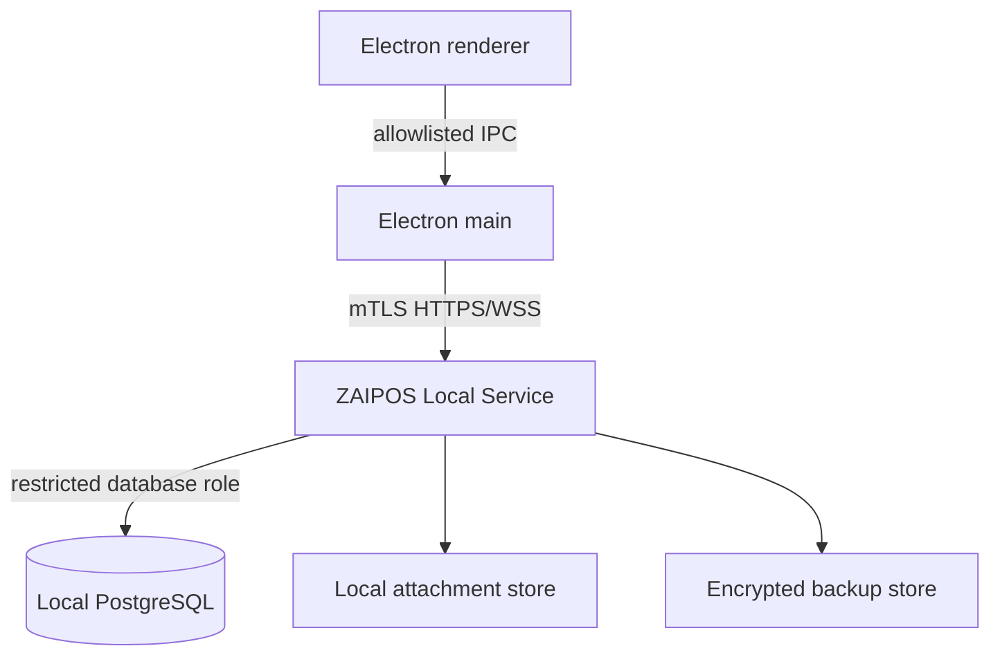

# ZAIPOS Fully Local LAN Architecture Design

**Date:** 2026-09-25  
**Status:** Proposed for implementation planning  
**Repository:** `MuhamedZanabal/ZAIPOS`  
**Authority base:** `main` at `e7c33a3c0159bee551fd78847090c1d3617d2ed6`  
**Target:** Windows 10/11 x64, single store server plus one or more LAN terminals

## 1. Objective

ZAIPOS must install, provision, authenticate, and execute its complete retail and restaurant workflows without Supabase, an internet connection, cloud credentials, or hosted infrastructure. One Windows machine in each store is the authoritative local server. The same machine may also run the primary cashier terminal. Additional terminals connect only over the store's private LAN.

The migration preserves exact BHD three-decimal accounting, atomic and idempotent financial effects, immutable audit evidence, tenant/branch/device/user/role isolation, fail-closed authorization, native credential custody, crash-safe recovery, canonical replay semantics, and the existing restriction that offline financial checkout remains disabled until separately proven.

## 2. Explicit non-goals

- Cloud synchronization, remote administration, SaaS tenancy, or internet-hosted authentication.
- Peer-to-peer multi-master databases.
- Direct renderer or terminal access to PostgreSQL credentials.
- Silent financial queuing while the local server is unavailable.
- Automatic import from Supabase without an explicitly authorized export/import operation.
- Enabling offline checkout as part of this migration.
- Replacing PostgreSQL accounting logic with client-side calculations.

## 3. Selected architecture

The store server runs two private components:

1. **ZAIPOS Local Service** — a native Windows service that owns authentication, authorization, API routing, event delivery, attachment custody, migrations, backups, and all database credentials.
2. **PostgreSQL** — the authoritative store database, installed and managed as a local Windows service.

Electron renderers communicate with Electron main through the existing allowlisted preload boundary. Electron main communicates with ZAIPOS Local Service through an authenticated HTTPS/WSS API. Only ZAIPOS Local Service connects to PostgreSQL.



This design is selected over direct PostgreSQL connections because terminals must never custody database credentials. It is selected over per-terminal SQLite because multi-writer accounting, inventory contention, device authority, and audit convergence already rely on PostgreSQL transaction semantics.

## 4. Deployment topology

### 4.1 Store server

The installer supports two roles:

- **Server + terminal**: PostgreSQL, ZAIPOS Local Service, and the desktop application run on one Windows PC.
- **Terminal only**: the desktop application connects to an existing store server over the private LAN.

The first server installation generates a store certificate authority, a server identity, a recovery bundle, and an owner bootstrap code. PostgreSQL listens only on loopback. ZAIPOS Local Service listens on loopback and the selected private-LAN interface. Windows Firewall permits only the selected private network profile and the service port.

### 4.2 Terminal enrollment

A terminal creates a non-exportable device key in Electron main and displays an enrollment request. An owner, administrator, or manager approves the request on an already trusted terminal. The server issues a device certificate bound to tenant, branch, terminal identifier, application version, and revocation state. Copied certificates fail because proof of possession requires the original device private key.

### 4.3 Discovery

The primary path is an explicit server address or QR enrollment payload containing the server address and CA fingerprint. Optional mDNS discovery may suggest servers, but never establishes trust. The operator must confirm the fingerprint or use an authenticated QR enrollment payload.

## 5. Local authentication and authorization

Supabase Auth is replaced by a local identity subsystem owned by ZAIPOS Local Service.

- Passwords and POS PINs use Argon2id with per-credential salts and versioned parameters.
- Successful authentication issues a short-lived signed session bound to user, tenant, branch, role set, account state, and device identity.
- Refresh requires an active user, active branch, non-revoked device, and proof of possession.
- Password reset requires an authorized owner workflow or a printed/offline recovery code generated during bootstrap.
- Session and recovery secrets are stored only in Electron main using Windows DPAPI-backed custody.
- Renderer state is never authoritative.

Every service command validates authentication, tenant, branch, user status, role, device status, payload scope, and idempotency identity before entering the database transaction. PostgreSQL retains defense-in-depth constraints, triggers, immutable audit, and transaction-local identity context. The service sets transaction-local claims through a restricted database role; terminals cannot set claims directly.

## 6. Database and migration model

The existing ordered PostgreSQL migration chain remains the schema authority. Migration execution moves from Supabase deployment to ZAIPOS Local Service provisioning.

On first startup, the service:

1. Creates or opens the local PostgreSQL cluster.
2. Acquires a global advisory migration lock.
3. Verifies checksums for every embedded migration.
4. Applies unapplied migrations in one recorded sequence.
5. Rejects modified historical migrations.
6. Runs schema-readiness probes.
7. Creates the first tenant, branch, owner, register, and trusted server terminal through the authoritative bootstrap transaction.

Migration history records filename, checksum, application version, start time, completion time, and failure detail. A failed migration leaves the service unavailable for business mutations and exposes a recovery screen with immutable diagnostics.

The Supabase-specific `auth.uid()`, JWT claim, Storage, Realtime, and Edge Function assumptions are replaced deliberately rather than emulated invisibly. PostgreSQL helpers consume transaction-local identity set by ZAIPOS Local Service.

## 7. API replacement boundaries

A typed `BackendClient` interface replaces direct `@supabase/supabase-js` use. It exposes domain operations, not generic table access.

```ts
export interface BackendClient {
  auth: LocalAuthClient;
  catalogue: CatalogueClient;
  inventory: InventoryClient;
  sales: SalesClient;
  cash: CashClient;
  customers: CustomerClient;
  suppliers: SupplierClient;
  restaurant: RestaurantClient;
  reports: ReportsClient;
  administration: AdministrationClient;
  events: LocalEventClient;
  attachments: LocalAttachmentClient;
}
```

Generic renderer calls equivalent to `.from()`, `.rpc()`, `.storage`, `.functions.invoke()`, or Realtime subscriptions are prohibited in the final tree. Each domain client calls a versioned local-service endpoint with a typed request and response.

The migration proceeds domain by domain behind this interface. A temporary Supabase adapter may exist only on the migration branch for parity testing. The production-complete build contains only the local adapter.

## 8. Edge Function replacement

Each current Edge Function becomes a local-service route or is removed:

- Device activation and credential rotation become local device-administration routes.
- User creation becomes a local owner/admin route.
- POS PIN verification becomes a local authentication route.
- Invoice processing and knowledge embedding become optional local workers; unavailable AI capability must not block POS operation.
- Email and WhatsApp functions remain disabled unless the operator separately configures an external provider. Their absence cannot affect core retail operation.
- Evolution webhook handling is excluded from the fully local core and remains an optional provider module.
- The disabled AI order agent remains disabled.

No local-service route may inherit a service-wide database role without first performing its declared authentication and authorization policy.

## 9. Attachments and event delivery

Supabase Storage is replaced by a content-addressed local attachment store owned by ZAIPOS Local Service. Metadata remains in PostgreSQL. Files are written through temporary files, hashed, fsynced, atomically renamed, and then referenced in a database transaction. Reads enforce tenant and branch policy before opening the object.

Supabase Realtime is replaced by an authenticated WSS event stream. Database commits append to a transactional outbox. The service delivers ordered tenant/branch-scoped events using monotonic sequence identifiers. Reconnection resumes from the last acknowledged sequence. Events are hints for cache invalidation; clients re-read authoritative state after reconnecting.

## 10. Financial and offline behavior

All financial operations continue to execute as authoritative PostgreSQL transactions through device-bound service commands. Amounts remain integer fils or exact `numeric(20,3)` values according to the existing contract. Floating-point money is forbidden.

If the service is unavailable:

- Financial submission is disabled.
- The current cart and non-authoritative UI state are preserved locally.
- No checkout, return, void, cash movement, supplier settlement, customer-credit mutation, delivery collection, or inventory-financial effect is queued for later execution.
- The UI identifies local-server unavailability separately from authentication, migration, and database-integrity failures.

The server + terminal machine continues operating through loopback when internet and LAN connectivity are absent. Offline checkout remains disabled until a separate design and physical acceptance program proves lease authority, contention, recovery, reconciliation, and operator workflows.

## 11. Backup, restore, and recovery

The service creates scheduled encrypted backups containing:

- A PostgreSQL logical backup.
- Attachment objects and manifest.
- Migration history and schema checksum manifest.
- Store CA and recovery metadata encrypted under an operator-held recovery secret.

Backups use temporary output, fsync, atomic rename, SHA-256 manifests, retention policy, and periodic restore verification. Restore runs only while business mutations are stopped, verifies the manifest before replacement, restores into a new database, runs integrity probes, and atomically promotes the recovered database. Every backup and restore attempt produces an immutable audit record.

Recovery objectives are not claimed until measured on production-like store hardware.

## 12. Existing Supabase data migration

Existing installations migrate through an explicit operator-controlled transfer:

1. Export through authoritative server-side export functions from the existing Supabase project.
2. Verify schema version, tenant identity, branch identity, record counts, monetary aggregates, and cryptographic manifest.
3. Import into an empty local database through ZAIPOS Local Service.
4. Validate accounting balances, inventory quantities, audit continuity, attachments, and idempotency records.
5. Produce a signed reconciliation report before local activation.

The import never reads a service-role key in the renderer. Production data is not modified or deleted automatically. Rollback retains the original Supabase installation until the operator accepts the reconciliation report.

## 13. Installer and lifecycle

The Windows installer must support:

- Server + terminal installation.
- Terminal-only installation.
- Silent service restart after safe upgrades.
- Migration preflight and backup before schema changes.
- Upgrade rollback when application binaries fail before schema commitment.
- Uninstall that asks separately whether to preserve or remove business data.
- A dedicated ZAIPOS administration utility for server status, terminal enrollment, backups, restore, logs, certificates, and database reset.

The application must never silently retain an unusable backend configuration after uninstall/reinstall. Data preservation and application configuration are separate choices.

## 14. Security boundaries

- PostgreSQL credentials exist only in ZAIPOS Local Service configuration protected by Windows ACLs and DPAPI where applicable.
- PostgreSQL accepts only loopback connections from the restricted service account.
- LAN traffic uses TLS with certificate pinning and enrolled device authentication.
- Electron retains context isolation, sandboxing, disabled Node integration, sender validation, and allowlisted IPC.
- Server APIs reject unknown fields, oversized inputs, path traversal, control characters, replay conflicts, and unsupported protocol versions.
- Audit records are append-only and protected by database triggers plus a forward hash chain.
- Logs redact passwords, PINs, session tokens, device private material, database credentials, recovery secrets, and personal data not required for diagnosis.
- Firewall and certificate configuration fail closed.

## 15. Phased delivery

### Phase A — Local service foundation

Create the Windows service, PostgreSQL provisioning, migration runner, health/readiness API, certificate bootstrap, and typed client transport. No business mutation moves in this phase.

### Phase B — Identity and administration

Implement local owner bootstrap, login, sessions, roles, tenant/branch context, device enrollment/revocation, and administrative recovery.

### Phase C — Authoritative transaction domains

Port checkout, returns, voids, cash, inventory, suppliers, customers, delivery, production, and restaurant commands with parity and adversarial tests.

### Phase D — Read domains and local events

Port catalogue, dashboards, reports, exports, attachments, and transactional-outbox event delivery.

### Phase E — Supabase removal and migration utility

Implement authorized export/import, remove all runtime Supabase imports and environment variables, remove the connector, and enforce zero-Supabase CI checks.

### Phase F — Windows acceptance

Build the combined installer; verify fresh install, upgrade, rollback, uninstall/reinstall, data preservation, LAN enrollment, multi-terminal contention, backup/restore, and disconnected internet operation on Windows hardware.

## 16. Verification requirements

Repository verification must include:

- Unit and integration tests for every local-service route and client.
- Real PostgreSQL migration-chain tests from an empty cluster.
- Positive and negative authorization tests for missing authentication, wrong tenant, wrong branch, unauthorized role, inactive account, inactive branch, revoked/copied device credential, payload conflict, and replay.
- Concurrent identical and conflicting financial commands.
- Process termination between database commit and response, followed by canonical replay.
- Attachment traversal, corruption, oversized file, tenant leakage, and interrupted-write tests.
- WSS resume, duplicate delivery, gap recovery, tenant/branch isolation, and stale-session tests.
- Backup corruption, wrong recovery secret, incomplete backup, restore failure, and post-restore reconciliation tests.
- Dependency and source census proving zero runtime Supabase packages, URLs, keys, SDK calls, Edge invocation, Storage, Realtime, or hosted-auth assumptions.
- Windows installer smoke tests with networking disabled.
- Two-terminal LAN contention tests on the final packaged build.

CI success does not establish signing, physical hardware compatibility, measured recovery objectives, or Bahrain regulatory acceptance.

## 17. Acceptance criteria

The fully local migration is complete only when all of the following are independently evidenced:

1. A clean Windows server installs without internet and provisions PostgreSQL plus ZAIPOS Local Service.
2. The operator creates the first RETAIL or RESTAURANT tenant, branch, owner, and register without Supabase credentials.
3. The packaged application restarts and upgrades without data loss.
4. Core POS, inventory, cash, customer, supplier, production, restaurant, reporting, and administrative workflows pass against the local service.
5. A second packaged Windows terminal enrolls over LAN and passes contention and isolation tests.
6. Financial effects remain atomic, idempotent, exact to three BHD decimals, and auditable through crash and response-loss scenarios.
7. Wrong-tenant, wrong-branch, wrong-role, inactive-account, revoked-device, copied-credential, and replay-conflict requests fail with zero unauthorized effects.
8. Backup and restore complete with verified manifests and reconciled financial/inventory totals.
9. Internet access can be blocked for the entire acceptance run without impairing core ZAIPOS operation.
10. The runtime tree and packaged binaries contain no Supabase dependency or required cloud endpoint.
11. Offline financial checkout remains disabled unless separately approved through its own acceptance gates.

## 18. Rollout and rollback

The local backend is developed behind a build-time migration flag until parity is complete. Production cutover is an explicit operator event after a successful export/import and reconciliation report. Rollback before acceptance returns terminals to the prior installation and leaves the Supabase project unchanged. After accepting the local system, rollback requires restoring the pre-cutover backup and reconciling any locally committed transactions; it is never an automatic database downgrade.

## 19. Residual external gates

The repository can implement and test the local architecture, but these remain external until evidenced:

- Windows code-signing certificate and signed installer verification.
- Target POS hardware acceptance for scanner, printer, and cash drawer.
- Production-like backup/restore timing and measured RPO/RTO.
- Accessibility, keyboard, touch, and real cashier workflow acceptance.
- Bahrain tax and regulatory acceptance.

